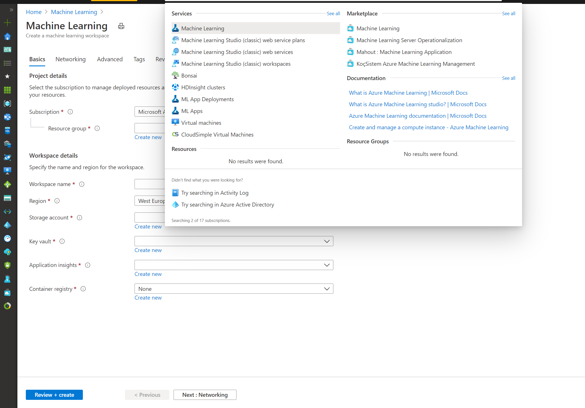
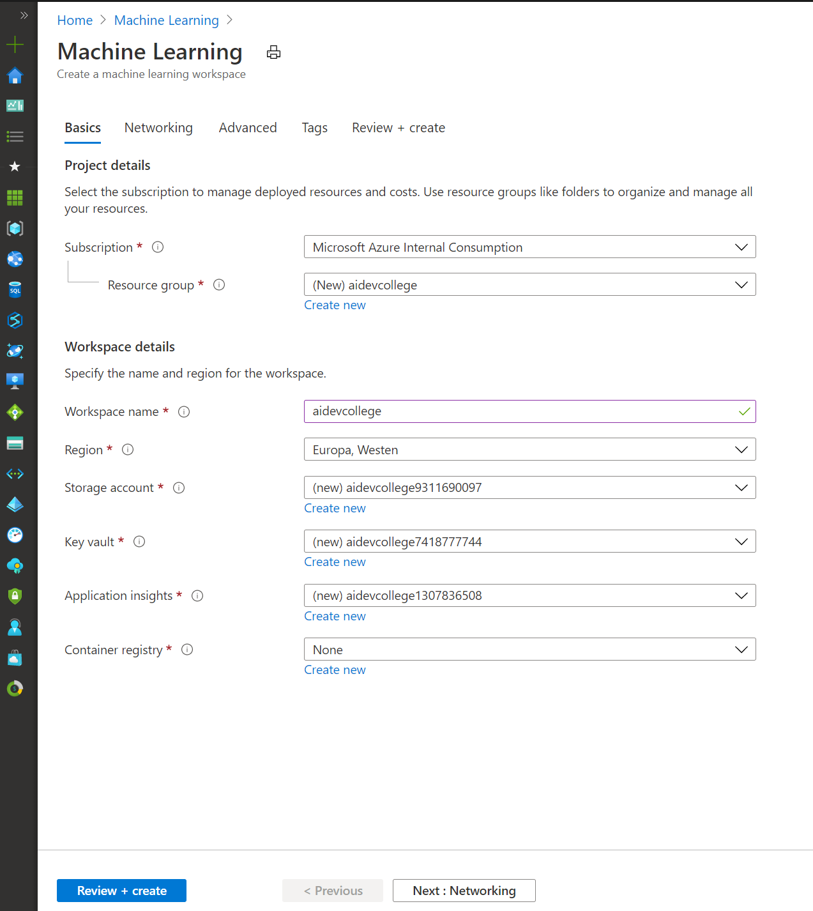
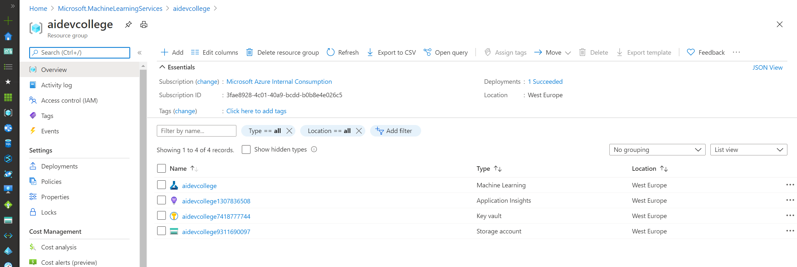
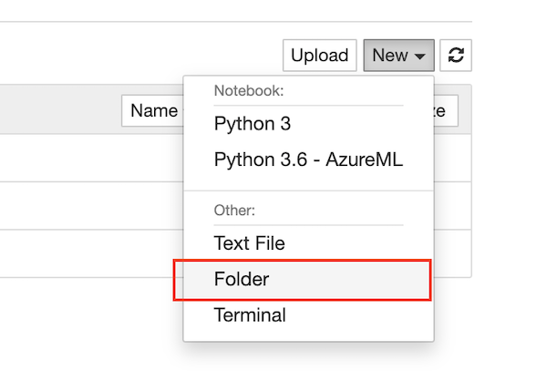
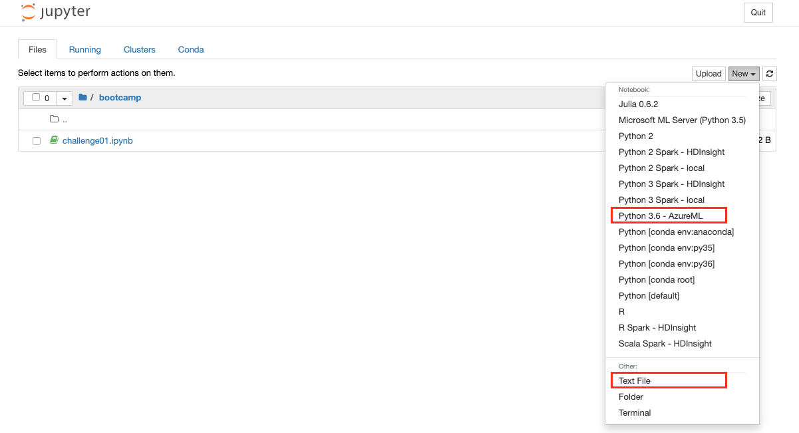
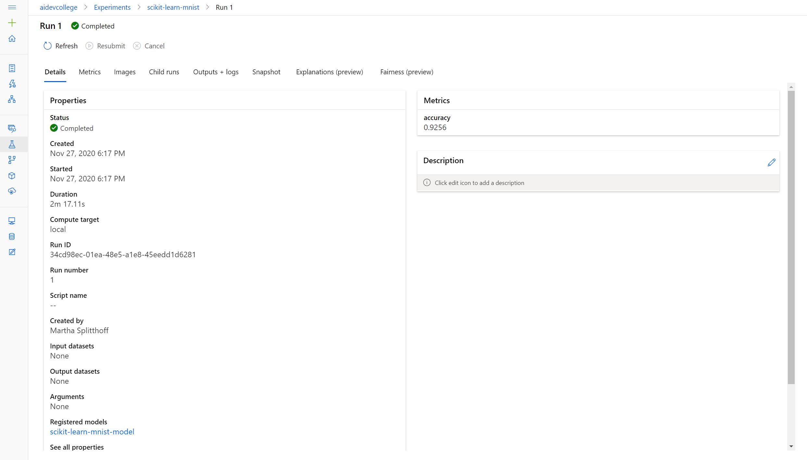
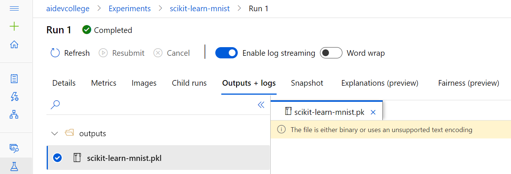

# Challenge 1

## Setup part

In the Azure Portal, create a new `Machine Learning` resource:



* Workspace name: `azure-ai-dev-college`
* Resource Group: `azure-ai-dev-college`
* Location: `West Europe`
* Leave the rest at default and create the service.



Let's have a look at our Resource Group:



* Application Insights - used for monitoring our models in production (will be used later)
* Storage account - this will store our logs, model outputs, training/testing data, etc.
* Key vault - stores our secrets (will be used later)
* Machine Learning service workspace - the center point for Machine Learning on Azure

Now we can either launch the `Machine Learning service workspace` in the Resource Group or we can open the [Azure Machine Learning Studio](https://ml.azure.com/) directly.

## Creating a Compute VM

Launch the `Machine Learning service workspace` and navigate to **Compute** so we can create a new `Compute VM`
The Compute VM actually sits inside this `Machine Learning service workspace`. It is just a regular Azure Virtual Machine.


Hit `Create`, select `STANDARD_D3_V2` and give it a unique name:


It'll take a few minutes until the VM has been created. The primary use for this VM is that we all have the same Jupyter environment. In this exercise, we'll use this VM to train a simple Machine Learning model. In a real-world setup, we might consider using a GPU-enabled instance, in case we need to perform Deep Learning or just rely on Azure Machine Learning Compute (challenge 2).

Once it is running, the UI will already give us links to `Jupyter`, `JupyterLab` and `RStudio`. To keep things simple, we'll use `Jupyter` throughout this ai dev college, but if you feel adventurous, use `JupyerLab` or `RStudio` solving the challenges in R.


You'll be using your AAD (Azure Active Directory) user to log into `Jupyter`. From an enterprise security point, this is a big plus. No extra credentials needed! :raised_hands:

## Initial Azure Machine Learning Setup

Inside the newly created Compute VM, first create a new folder via the `New` button on the top right of Jupyter. Everything we'll do in this workshop should happen in this folder. This is because Machine Learning Services will persist the whole contents of the experiment's folder, which exceeds the limit when you run your Jupyter Notebooks in the root folder.



**Note:** The next block is not needed anymore (as of May 2019), but you'd need it if you want to connect to your Azure Machine Learning Workspace from e.g., your local machine. Since the `Compute VM` runs inside the workspace, it automatically connects to the workspace it lives in.

<details>
~~Next, create a text file called `config.json` (also via the `New` button) and replace the values with your own (you'll find your Subscription ID in the Azure Portal at the top of your Resource Group):~~

```json
# Ignore this block, unless you run Jupyer directly on e.g., your laptop
{
    "subscription_id": "xxxxxxx-xxxx-xxxx-xxxx-xxxxxxxxx",
    "resource_group": "azure-ai-dev-college",
    "workspace_name": "azure-ai-dev-college"
}
```



~~The `config.json` is used by the `Azure Machine Learning SDK` to connect to your `Azure Machine Learning workspace` running in Azure.~~
</details>

Finally, we can click the `New` button and create a new Notebook of type: `Python 3.6 - AzureML`. A new browser tab should open up and we can click the name `Untitled` and rename it to `challenge01.ipynb`.


## Training a basic Machine Learning model

Inside your `challenge01.ipynb` notebook, create a new cell:

```python
from azureml.core import Workspace, Experiment, Run

ws = Workspace.from_config()
```

You can run or re-run any cell by hitting `Run` or pressing `Shift+Enter` or `Ctrl+Enter`. Code cells have brackets left to them. If the brackets are empty `[ ]`, the code has not been run. While the code is running, you will see an asterisk `[*]`. After the code completes, a number `[1]` appears. The number tells you in which order the cells ran. You can always re-run arbitrary cells, in case something didn't work on the first try.

This first cell imports the relevant libraries from the Azure Machine Learning SDK, ~~reads our `config.json`~~ and connects the notebook to our Machine Learning Workspace in Azure. You will need to authenticate to your Azure subscription:


Have a look at the following note when experiencing subscription ID errors (this should not happen any more when using a `Azure Compute VM`):

<details>
If you are using multiple subscriptions or tenants, it might be required to tell the Jupyter Notebook, which one it should use. Hence, create a new cell and adapt the following code to use your subscription id (the one you have used in `config.json`):

```
!az account set -s "xxxxxxx-xxxx-xxxx-xxxx-xxxxxxxxx"
```

Once you have ran the cell, restart the Notebook kernel (`Kernel` --> `Restart & Clear Output`) and wait a few seconds until it has restarted.
</details>

Next, let's create a new experiment (this will later show up in our Workspace after you've ran the first experiment) in a second cell. This is where all our experiment runs will be logged to:

```python
experiment = Experiment(workspace = ws, name = "scikit-learn-mnist")
```

Let's load some test data into our Compute VM (we'll do something more scalable in the next challenge):

```python
import os
import urllib.request

os.makedirs('./data', exist_ok = True)

urllib.request.urlretrieve('http://yann.lecun.com/exdb/mnist/train-images-idx3-ubyte.gz', filename='./data/train-images.gz')
urllib.request.urlretrieve('http://yann.lecun.com/exdb/mnist/train-labels-idx1-ubyte.gz', filename='./data/train-labels.gz')
urllib.request.urlretrieve('http://yann.lecun.com/exdb/mnist/t10k-images-idx3-ubyte.gz', filename='./data/test-images.gz')
urllib.request.urlretrieve('http://yann.lecun.com/exdb/mnist/t10k-labels-idx1-ubyte.gz', filename='./data/test-labels.gz')
```

Let's create a fourth cell for training our model:

```python
import numpy as np
import gzip
import struct
import joblib
from sklearn.linear_model import LogisticRegression

# load compressed MNIST gz files we just downloaded and return numpy arrays
def load_data(filename, label=False):
    with gzip.open(filename) as gz:
        struct.unpack('I', gz.read(4))
        n_items = struct.unpack('>I', gz.read(4))
        if not label:
            n_rows = struct.unpack('>I', gz.read(4))[0]
            n_cols = struct.unpack('>I', gz.read(4))[0]
            res = np.frombuffer(gz.read(n_items[0] * n_rows * n_cols), dtype=np.uint8)
            res = res.reshape(n_items[0], n_rows * n_cols)
        else:
            res = np.frombuffer(gz.read(n_items[0]), dtype=np.uint8)
            res = res.reshape(n_items[0], 1)
    return res

# We need to scale our data to values between 0 and 1
X_train = load_data('./data/train-images.gz', False) / 255.0
y_train = load_data('./data/train-labels.gz', True).reshape(-1)
X_test = load_data('./data/test-images.gz', False) / 255.0
y_test = load_data('./data/test-labels.gz', True).reshape(-1)

# Tell our Azure ML Workspace that a new run is starting
run = experiment.start_logging()

# Create a Logistic Regression classifier and train it
clf = LogisticRegression(multi_class='auto', max_iter=2000)
clf.fit(X_train, y_train)

# Predict classes of our testing dataset
y_pred = clf.predict(X_test)

# Calculate accuracy
acc = np.average(y_pred == y_test)
print('Accuracy is', acc)

# Log accuracy to our Azure ML Workspace
run.log('accuracy', acc)

# Tell our Azure ML Workspace that the run has completed
run.complete()
```

On our `STANARD_D3_V2` instance, the code should take around ~1 minutes to run (any warnings you get can be ignored).

In summary, the code does the following things:

1. Imports `sklearn` (scikit-learn) as the Machine Learning framework
1. Creates a helper function for loading our data (`load_data(...)`)
1. Loads our MNIST train and test data, and scales all values to `[0, 1]`
1. Tells our Azure ML Experiment to start logging a training run
1. Creates a [`LogisticRegression`](https://ml-cheatsheet.readthedocs.io/en/latest/logistic_regression.html) - based classifier and trains it using the training data
1. Uses the classifier to predict the numbers in the test dataset
1. Compares the predictions to the ground truth and calculates the accuracy score
1. Logs to accuracy to our run and finishes the run

As we can see, our model achieves `~92%` accuracy, which is actually pretty low for the MNIST dataset - we'll get back to this in the next challenge!

In the Azure ML Workspace, we can see that our experiment is finally showing up:


Inside our experiment, we can see our first run (your view might differ slightly):


If we click the run number, we can see its details:



We can [track more values or even time series](https://docs.microsoft.com/en-us/azure/machine-learning/service/how-to-track-experiments), which would directly show up as diagrams. However, as we want to keep the code short, we'll skip this part for now (more on that in challenge 2).

Finally, we can export our model and upload it to our Azure ML Workspace in the `outputs` directory:

```python
import joblib

# Write model to disk
joblib.dump(value=clf, filename='scikit-learn-mnist.pkl')

# Upload our model to our experiment
run.upload_file(name = 'outputs/scikit-learn-mnist.pkl', path_or_stream = './scikit-learn-mnist.pkl')
```

In the portal, we can now see the output of our run:



We can also query our tracked metrics and outputs for our current run:

```python
print("Run metrics:", run.get_metrics())
print("Run model files", run.get_file_names())
```

As a last step, we can register (version, tag, and store) our model in our workspace:

```python
model = run.register_model(model_name='scikit-learn-mnist-model', model_path='outputs/scikit-learn-mnist.pkl')
print(model.name, model.id, model.version, sep = '\t')
```

We probably would not do this for every model we train, but for those that we want to promote to the next stage and potentially consider for deployment.

Under the `Models` tab, we can now see that our model has been registered:


Our model has been stored in the Storage Account that has been created initially for us:


At this point:

* We've trained a Machine Learning model using scikit-learn inside a `Compute VM` running `Jupyter`
* We achieved `92%` accuracy (not very good for this data set)
* Azure ML knows about our experiment and our initial run and tracked metrics
* Azure ML saved our model file (`scikit-learn-mnist.pkl`) in Blob storage
* We have registered our initial model as a Azure ML Model in our Workspace

In the [next challenge](challenge_02.md), we'll build a more powerful model and use Azure Machine Learning Compute to train it on a remote cluster.