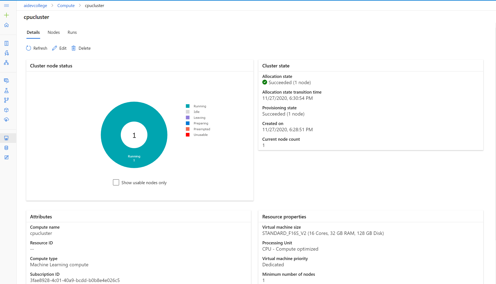
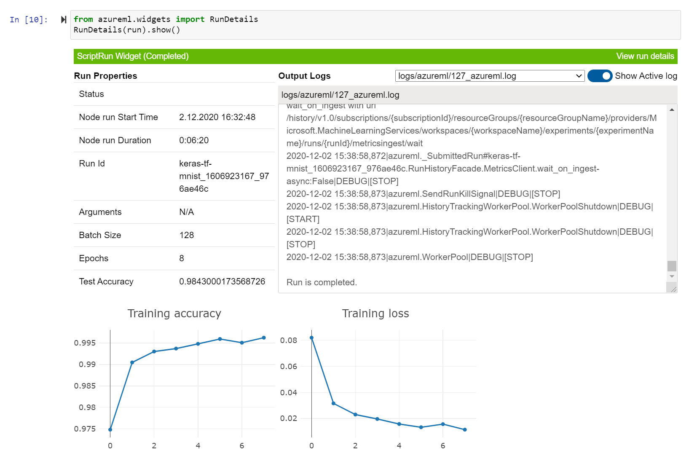
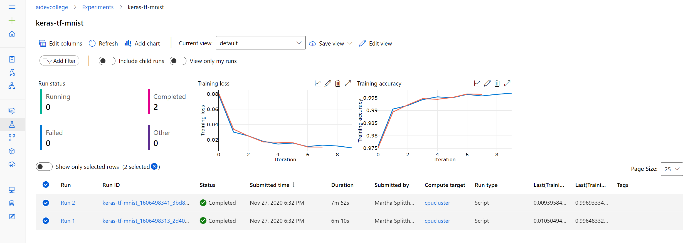

# Challenge 2

In challenge 1, our model achieved an accuracy of `~92%`. For the MNIST data set, this is not very good. For improving model accuracy, we'll be training a Deep Convolutional Neural Network in this challenge. For training this more powerful and complex model, we'll need more compute. Therefore, instead of training a model in our Notebook VM, we'll be using [Azure Machine Learning Compute](https://docs.microsoft.com/en-us/azure/machine-learning/service/how-to-set-up-training-targets) to train our model on a dedicated compute cluster. As a Machine Learning framework, we'll be using Keras with a TensorFlow backend. The good thing is, that the interaction with Azure Machine Learning won't change.

**Note:** Obviously we do not need Azure Machine Learning Compute for such a simple task, a single VM instance (probably even without GPU) would be absolutely sufficient. However - for sake of education - we'll be using Azure Machine Learning Compute in this challenge. 

First, let's create a new notebook `challenge02.ipynb` for this challenge.

As before, let's connect to our Azure ML Workspace, but we'll create a new experiment this time:

```python
from azureml.core import Workspace, Experiment, Run
ws = Workspace.from_config()

experiment = Experiment(workspace = ws, name = "keras-tf-mnist")
```

We should still have our MNIST dataset sitting in the `./data/` folder from challenge 1, but just in case, we'll download it again:

```python
import os
import urllib.request

os.makedirs('./data', exist_ok = True)

urllib.request.urlretrieve('http://yann.lecun.com/exdb/mnist/train-images-idx3-ubyte.gz', filename='./data/train-images.gz')
urllib.request.urlretrieve('http://yann.lecun.com/exdb/mnist/train-labels-idx1-ubyte.gz', filename='./data/train-labels.gz')
urllib.request.urlretrieve('http://yann.lecun.com/exdb/mnist/t10k-images-idx3-ubyte.gz', filename='./data/test-images.gz')
urllib.request.urlretrieve('http://yann.lecun.com/exdb/mnist/t10k-labels-idx1-ubyte.gz', filename='./data/test-labels.gz')
```

In this challenge, we'll be training remotely. Therefore, we'll need to be able to access the MNIST dataset from our Azure Machine Learning Compute cluster.

To do so, we'll upload our data to the default datastore that our Azure ML Workspace provided for us. This code will retrieve the default datastore (Azure Blob) and upload the four files from MNIST into the `./mnist` folder:

```python
ds = ws.get_default_datastore()

print("Datastore details:")
print("Type:", ds.datastore_type)
print("Storage Account:", ds.account_name)
print("Blob Container Name:", ds.container_name)

ds.upload(src_dir='./data', target_path='mnist', overwrite=True, show_progress=True)
```

If we go to the default Storage Account that the Azure ML Workspace created for us, then select Azure Blob, we can see that the dataset has been uploaded:


Next, we can create an `Azure Machine Learning Compute` cluster in Azure:

```python
from azureml.core.compute import AmlCompute
from azureml.core.compute import ComputeTarget
import os

# Configure our cluster details
compute_name = "cpucluster"
compute_min_nodes = 1
compute_max_nodes = 1
vm_size = "Standard_F16s_v2"

# Check if a cluster with the same name already exists
compute_targets = ws.compute_targets
if compute_name in compute_targets and compute_targets[compute_name].type == 'AmlCompute':
    print("Found compute target, let's just reuse it:", compute_name)
    compute_target = ws.compute_targets[compute_name]

else:
    print('Creating a new compute target, this will take a few minutes...')
    compute_config = AmlCompute.provisioning_configuration(vm_size = vm_size,
                                                           min_nodes = compute_min_nodes,
                                                           max_nodes = compute_max_nodes)

    # Create the cluster
    compute_target = ComputeTarget.create(ws, compute_name, compute_config)
    
    # We can poll for a minimum number of nodes and for a specific timeout. 
    compute_target.wait_for_completion(show_output=True, min_node_count=None, timeout_in_minutes=20)
    
    # For a more detailed view of current AmlCompute status, use the 'status' property    
    print(compute_target.status.serialize())
```

The cluster VM(s) will take around 2-4 minutes to spin up (looks like this got a lot faster as of May 2019 :clap:).

As we can see, we can configure our minimum and maximum cluster size, and most importantly, the VM size. In our example, we'll stick with a medium VM without GPU for saving cost. If you want, you can try out a more powerful VM, or even a `NC` instance. More details on further configuration parameters can be found [here](https://docs.microsoft.com/en-us/python/api/azureml-core/azureml.core.compute.amlcompute(class)?view=azure-ml-py#provisioning-configuration-vm-size-----vm-priority--dedicated---min-nodes-0--max-nodes-none--idle-seconds-before-scaledown-none--vnet-resourcegroup-name-none--vnet-name-none--subnet-name-none--tags-none--description-none-), as for example `idle_seconds_before_scaledown`, which defines when the cluster should auto-scale down (only makes sense if `min_nodes != max_nodes`).

If we now look under the `Compute` tab beneath `Training clusters` in our Azure ML Workspace, we can see our Azure Machine Learning Compute cluster:


In the last challenge, we had all our code in our Jupyter Notebook. Since we're training remotely now, our Machine Learning Compute cluster needs to somehow get the Python code for reading the data and training our model. Hence, we create a `scripts` folder and put our training Python code in it (useful if we're using multiple `*.py` files):

```python
import os, shutil

script_folder = './scripts'
os.makedirs(script_folder, exist_ok=True)
```

This cell writes the `train.py` to the `scripts` folder (we could have created it manually and copied it in):

```python
%%writefile $script_folder/train.py

import argparse
import os
import numpy as np
import gzip
import struct

import tensorflow as tf
from tensorflow.keras.datasets import mnist
from tensorflow.keras.models import Sequential
from tensorflow.keras.layers import Dense, Dropout, Flatten, BatchNormalization
from tensorflow.keras.layers import Conv2D, MaxPooling2D
from tensorflow.keras import backend as K
from tensorflow.keras.callbacks import EarlyStopping, Callback

from azureml.core import Run

# load compressed MNIST gz files we just downloaded and return numpy arrays # Preprocessing of the Images for training 
# Formats of the Images are complex
def load_data(filename, label=False):
    with gzip.open(filename) as gz:
        struct.unpack('I', gz.read(4))
        n_items = struct.unpack('>I', gz.read(4))
        if not label:
            n_rows = struct.unpack('>I', gz.read(4))[0]
            n_cols = struct.unpack('>I', gz.read(4))[0]
            res = np.frombuffer(gz.read(n_items[0] * n_rows * n_cols), dtype=np.uint8)
            res = res.reshape(n_items[0], n_rows * n_cols)
        else:
            res = np.frombuffer(gz.read(n_items[0]), dtype=np.uint8)
            res = res.reshape(n_items[0], 1)
    return res

# Helper class for real-time logging # Logs every epoch and the Training accuracy
class CheckpointCallback(Callback):
    def __init__(self, run):
        self.run = run

    def on_train_begin(self, logs={}):
        return

    def on_train_end(self, logs={}):
        return

    def on_epoch_begin(self, epoch, logs={}):
        return

    def on_epoch_end(self, epoch, logs={}):
        self.run.log('Training accuracy', logs.get('acc'))
        self.run.log('Training loss', logs.get('loss'))
        return

    def on_batch_begin(self, batch, logs={}):
        return

    def on_batch_end(self, batch, logs={}):
        return

# input image dimensions and number of classes
img_rows, img_cols = 28, 28
num_classes = 10

# let user feed in parameters
parser = argparse.ArgumentParser()
parser.add_argument('--data-folder', type=str, dest='data_folder', help='data folder mounting point')
parser.add_argument('--batch-size', type=int, dest='batch_size', default=128, help='batch size')
parser.add_argument('--epochs', type=int, dest='epochs', default=12, help='number of epochs')

args = parser.parse_args()
batch_size = args.batch_size
epochs = args.epochs
data_folder = os.path.join(args.data_folder, 'mnist')

print('Data folder:', data_folder)

# load train and test set into numpy arrays and scale # Normalize images to have the columns with the same number range (scala)
x_train = load_data(os.path.join(data_folder, 'train-images.gz'), False) / 255.0
x_test = load_data(os.path.join(data_folder, 'test-images.gz'), False) / 255.0
y_train = load_data(os.path.join(data_folder, 'train-labels.gz'), True).reshape(-1) #Reverting
y_test = load_data(os.path.join(data_folder, 'test-labels.gz'), True).reshape(-1)

if K.image_data_format() == 'channels_first':
    x_train = x_train.reshape(x_train.shape[0], 1, img_rows, img_cols) # Reshaping images to unify the formats
    x_test = x_test.reshape(x_test.shape[0], 1, img_rows, img_cols) # Some formats need different kind of reshaping
    input_shape = (1, img_rows, img_cols)
else:
    x_train = x_train.reshape(x_train.shape[0], img_rows, img_cols, 1)
    x_test = x_test.reshape(x_test.shape[0], img_rows, img_cols, 1)
    input_shape = (img_rows, img_cols, 1)
    
# convert class vectors to binary class matrices
y_train = tf.keras.utils.to_categorical(y_train, num_classes) # Labels 0-9 but we want to predict classes
y_test = tf.keras.utils.to_categorical(y_test, num_classes) # Softmax calculates probability of each class (multi classifcation)
# We train the ideal case

print(x_train.shape)
print(y_train.shape)
print(x_test.shape)
print(y_test.shape)

# get hold of the current run
run = Run.get_submitted_run()

# Design our Convolutional Neural Network
model = Sequential() #stacking layers on top of each other
model.add(Conv2D(filters=64, kernel_size = (3,3), activation="relu", input_shape=input_shape)) #Feature detection within a tensor (multidimensional array) relu y=max(0,x)
model.add(Conv2D(filters=64, kernel_size = (3,3), activation="relu")) #kernel_size -> filter which is 3x3 pixel big -> depth = 64
model.add(MaxPooling2D(pool_size=(2,2))) #Max Pooling 2x2 max value of 4 pixel and compress the image
model.add(BatchNormalization()) # Normalize the image
model.add(Conv2D(filters=128, kernel_size = (3,3), activation="relu"))
model.add(Conv2D(filters=128, kernel_size = (3,3), activation="relu"))
model.add(MaxPooling2D(pool_size=(2,2)))
model.add(BatchNormalization())
model.add(Conv2D(filters=256, kernel_size = (3,3), activation="relu"))
model.add(MaxPooling2D(pool_size=(2,2)))
model.add(Flatten()) # Flattening the tensor from a x*y tensor -> reshaping to x
model.add(BatchNormalization())
model.add(Dense(512,activation="relu")) #fully connected layer -> every input value will be calculated with the relu function and returns the output
model.add(Dense(num_classes, activation='softmax')) # 10 classes and get the probability of 10 classes for each image

model.compile(loss=tf.keras.losses.categorical_crossentropy, # loss -> (um welchen Wert x lag das Modell falsch) to which value the model predicted incorrectly - logarithm (Cross Entropy)
              optimizer=tf.keras.optimizers.Adam(), #an algorithm to calculate the minimal loss function
              metrics=['acc']) #accuracy - in how many cases did the model incorrectly predict the images

# Train our model and use callback to log every epoch to AML
checkpoints = CheckpointCallback(run) # save the model
stop_training = [EarlyStopping(monitor='val_acc', patience=5, mode='max')] # stop training once the validation accuracy isn't improving significantly every 5 epochs
train_score = model.fit(x_train, y_train, # use train datasets - x (Images) - y (Labels)
                        batch_size=batch_size, # use batch size - how many train data are saved in memory - the higher the more RAM is used
                        epochs=epochs, # Forward Propagation - Backward Propagation - how often the 60.000 images are shown to the image
                        verbose=1, # log settings - how informative is the training process via logging
                        validation_data=(x_test, y_test), # Use Test Data to test the model
                        callbacks=[checkpoints, stop_training]) #save model and stop training

test_score = model.evaluate(x_test, y_test, verbose=0)

# Log accuracy and run details to our Azure ML Workspace
run.log('Test Accuracy', np.float(test_score[1]))
run.log('Batch Size', batch_size)
run.log('Epochs', epochs)

# Save model, the outputs folder is automatically uploaded into experiment record by AML Compute
os.makedirs('outputs', exist_ok=True)
model.save('./outputs/keras-tf-mnist.h5')
```

This looks a little bit more complex than our last example! Let's walk through what this script does:

1. We define a custom callback class for logging the results of each epoch into our Azure Machine Learning workspace
1. We define the input parameters for the script (data folder, batch size, and number of training epochs)
1. We load the data from our Azure Blob share
1. We transform the data to the format that `Keras` expects
1. We get hold of the current run (`Run.get_submitted_run()`) - the SDK will manage the run this time
1. We build a Convolution Neural Network with two convolutional layers with ReLu as the activation function, followed by a dense 128 neuron large fully connected layer
1. We let `Keras` assemble and train the model
1. We run our test data through it and get the predictions
1. We log the final train and test accuracies to our experiment
1. We save the model to the `outputs/` folder (Azure Machine Learning Compute will automatically upload that folder to the experiment afterwards)

To get the training working, we need create an environment and package the scripts:

```python
from azureml.core import Environment
from azureml.core.conda_dependencies import CondaDependencies

# Create a Python environment for the experiment
# Let Azure ML manage dependencies by setting user_managed_dependencies to False
# Use docker containers by setting docker.enabled to True
# Our workspace needs to know what environment to use
env = Environment("aidevcollege-env")
env.python.user_managed_dependencies = False # Let Azure ML manage dependencies
env.docker.enabled = True # Use a docker container

# Create a the pip and conda package dependencies
packages = CondaDependencies.create(pip_packages=["tensorflow","keras", "astor", 'azureml-sdk', 
                                                  'pynacl==1.2.1', 'azureml-dataprep'])

# Add the package dependencies to the Python environment for the experiment
env.python.conda_dependencies = packages
    
# Register the environment 
env.register(workspace=ws)
registered_env = Environment.get(ws, 'aidevcollege-env')

```
Then we "send" them to Azure Machine Learning Compute. Azure ML uses the `ScriptRunConfig` class for that:
Which is a configuration for the `Runs` of the `Experiments`.

```python
from azureml.train.estimator import Estimator
from azureml.core import ScriptRunConfig

ds = ws.get_default_datastore()

script_params = [ '--data-folder', str(ds.as_mount()), '--batch-size', 128, '--epochs', 8]


# Training Script and Parameters are used in the estimator to run an experiment
estimator = ScriptRunConfig(source_directory=script_folder,
                arguments=script_params,
                compute_target = compute_target,
                environment=registered_env,
                script='train.py')

estimator.run_config.data_references = {ds.as_mount().data_reference_name: ds.as_mount().to_config()}
```

As you can see, we define where our scripts are, what the compute target should be, and the dependencies (`keras` in this case). Lastly, we also give in the script some static parameters, but ideally we would [automatically try out different hyperparameters](https://docs.microsoft.com/en-us/azure/machine-learning/service/how-to-tune-hyperparameters) to get superior accuracy (not covered here).

**Note**: There is also a separate `TensorFlow` Estimator for just TensorFlow, see [here](https://docs.microsoft.com/en-us/azure/machine-learning/service/how-to-train-tensorflow). Since we want to keep it generic in this challenge, we'll rely on the standard `Estimator`.

Lastly, we can kick off the job:

```python
run = experiment.submit(config=estimator)
run
```

The link `Link to Azure Portal` will bring us directly into our workspace:


Under the `Compute` tab, we can also see that our cluster is now training the model:



While the training is running, we can also display a nice widget directly in our notebook:

```python
from azureml.widgets import RunDetails
RunDetails(run).show()
```



In the background, Azure ML Services will now perform the following steps:

* Package our scripts and dependencies as a Docker image and push it to our Azure Container Registry (initially this will take ~5 minutes) - the Azure Container Registry will be created automatically
* (Scale up the Azure Machine Learning Compute cluster - not happening here, since we have `min_size=1`)
* Pull the Docker image to the Azure Machine Learning Compute cluster
* Mount the MNIST data from Azure Blob to the Azure Machine Learning Compute cluster
* Start the training job
* Publish the results to our Workspace (same as in the last challenge)

We can see the status of the training run by checking our experiment:


The first run takes around ~10-12 minutes. Subsequent runs will be significantly faster (~5 minutes) as the base Docker image will be re-used. By using a more powerful VM, a single run can probably be executed in less than a minute (in case if you use a GPU-equipped instance, but then you might need to tell your framework to use it).

With the same code as before (this is the strength of Azure ML), we can retrieve the results of our training run:

```python
print("Run metrics:", run.get_metrics())
print("Run model files", run.get_file_names())
```

This time we logged our training details as charts:



This already looks much better, we're now able to predict our test data with over `99%` accuracy!

Lastly, we can register our new model (this is the same code as before):

```python
model = run.register_model(model_name='keras-tf-mnist-model', model_path='outputs/keras-tf-mnist.h5')
print(model.name, model.id, model.version, sep = '\t')
```

If we want, we can also delete our Azure Machine Learning Compute cluster (we will need it again in challenge 3, but re-creation only takes 2 minutes):

```python
compute_target.delete()
```

At this point (in addition to the results from challenge 1):

* We used the Azure Machine Learning SDK with Azure Machine Learning Compute in the background to train a Convolutional Neural Network (CNN)
* We switched our training framework from scikit-learn to Keras with TensorFlow in the backend (without changing any Azure ML SDK code!)
* We registered our new model (>`99%` accuracy) in our Azure ML Workspace

Great, now we have a well performing model. Obviously, we want other people, maybe some developers, make use of it. Therefore, we'll deploy it as an API to an Azure Container Instance in the [next challenge](challenge_03.md).


## Optional: Retrieving the Data from Web Paths as a second Option for this challenge

If you do not want to upload the data to a blob storage - you can retrieve them directly from the respective URLS:
For this you need to adjust the training script, the estimator and import the data via a web path. 
You need to change the respective code in the steps above.
Here you can see that the data is retrieved directly from the data folder which will be later set per command line as a web paths:

```python

# ...... SAME CODE FROM ABOVE ...........
data_folder = args.data_folder
print('Data folder:', data_folder)

# get the file paths on the compute
x_train_path = glob.glob(os.path.join(data_folder, '**/train-images-idx3-ubyte.gz'), recursive=True)[0]
x_test_path = glob.glob(os.path.join(data_folder, '**/t10k-images-idx3-ubyte.gz'), recursive=True)[0]
y_train_path = glob.glob(os.path.join(data_folder, '**/train-labels-idx1-ubyte.gz'), recursive=True)[0]
y_test = glob.glob(os.path.join(data_folder, '**/t10k-labels-idx1-ubyte.gz'), recursive=True)[0]

# load train and test set into numpy arrays
x_train = load_data(x_train_path, False) / 255.0
x_test = load_data(x_test_path, False) / 255.0
y_train = load_data(y_train_path, True).reshape(-1)
y_test = load_data(y_test, True).reshape(-1)

# ...... SAME CODE FROM ABOVE ...........

```

Here we introduce the Dataset Class - and retrieve directly the dataset from the respective MNIST URLs:

```python
from azureml.train.estimator import Estimator
from azureml.core import ScriptRunConfig
from azureml.core.dataset import Dataset

web_paths = [
            'http://yann.lecun.com/exdb/mnist/train-images-idx3-ubyte.gz',
            'http://yann.lecun.com/exdb/mnist/train-labels-idx1-ubyte.gz',
            'http://yann.lecun.com/exdb/mnist/t10k-images-idx3-ubyte.gz',
            'http://yann.lecun.com/exdb/mnist/t10k-labels-idx1-ubyte.gz'
            ]

ds = Dataset.File.from_files(path = web_paths)

script_params = [ '--data-folder', ds.as_mount(), '--batch-size', 128, '--epochs', 8]


# Training Script and Parameters are used in the estimator to run an experiment
estimator2 = ScriptRunConfig(source_directory=script_folder,
                arguments=script_params,
                compute_target = compute_target,
                environment=registered_env,
                script='train2.py')
```
