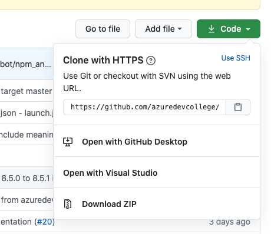
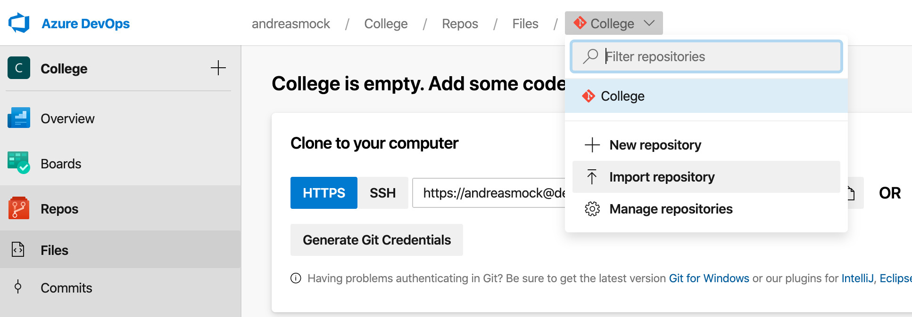

# MLOps on Azure
This repository contains examples of how to implement [MLOps](https://en.wikipedia.org/wiki/MLOps) using [Azure ML Services](https://azure.microsoft.com/en-us/services/machine-learning-service/) and [Azure DevOps](https://azure.microsoft.com/en-us/services/devops/).

## What is MLOps?
**MLOps** (a compound of "[machine learning](https://en.wikipedia.org/wiki/Machine_learning)" and "operations") is a practice for collaboration and communication between [data scientists](https://en.wikipedia.org/wiki/Data_scientists) and operations professionals to help manage production ML lifecycle.
Similar to the [DevOps](https://en.wikipedia.org/wiki/DevOps) or [DataOps](https://en.wikipedia.org/wiki/DataOps) approaches, MLOps looks to increase automation and improve the quality of production ML while also focusing on business and regulatory requirements.

## How does Azure ML help with MLOps?
Azure ML contains a number of asset management and orchestration services to help you manage the lifecycle of your model training & deployment workflows.

With Azure ML + Azure DevOps you can effectively and cohesively manage your datasets, experiments, models, and ML-infused applications.


# Challenege-0: Create an Azure DevOps Organisation


## Here is what you will learn
- Create an Azure DevOps account for your organisation
- Create a Team Project with an Agile Process Template

## Azure DevOps
Azure DevOps provides developer services to support teams to plan work, collaborate on code development, and build and deploy applications. 
Developers can work in the cloud using Azure DevOps Services or on-premises using Azure DevOps Server. Azure DevOps Server was formerly named Visual Studio Team Foundation Server (TFS).

Azure DevOps provides integrated features that you can access through your web browser or IDE client. You can use one or more of the following services based on your business needs:
- __Azure Repos__ provides Git repositories or Team Foundation Version Control (TFVC) for source control of your code
- __Azure Pipelines__ provides build and release services to support continuous integration and delivery of your apps
- __Azure Boards__ delivers a suite of Agile tools to support planning and tracking work, code defects, and issues using Kanban and Scrum methods
- __Azure Test Plans__ provides several tools to test your apps, including manual/exploratory testing and continuous testing
- __Azure Artifacts__ allows teams to share Maven, npm, and NuGet packages from public and private sources and integrate package sharing into your CI/CD pipelines

## Getting started

To get started with Azure DevOps navigate to the [Azure DevOps overview page](https://azure.microsoft.com/services/devops/). Here you will find further links to the documentation, support, pricing and Blogs. 

## Authentication
Before we can create an Azure DevOps account we need to understand which Identity Providers are supported by Azure DevOps. 
Azure AD, MSA (Microsoft account) and a GitHub account is supported if you want to use cloud authentication. It is recommended to use Azure AD when a large group of users must be managed or if you want to integrate Azure DevOps to your organisation's Azure AD, otherwise use your Microsoft account or a GitHub account.
For on-premises deployments Active Directory is recommended.

__Note:__ If you want to integrate Azure DevOps into your organization's Azure AD make sure that you have the needed permission to create a ServicePrincipal in your Azure AD. We will create a ServicePrincipal in further challenges to authorize Azure DevOps to access your Azure Subscription in order to deploy Azure resources.

## Create an Azure DevOps organisation
1. Navigate to [Azure DevOps](https://azure.microsoft.com/services/devops/)
2. Click "Start for free >", if you don't see a login page, please open a private browser window to make sure that you use the right account (either an Azure AD, MSA or GitHub account). 
3. Give your new project a name and select a country/region.
4. Create an organization. Instructions can be found [here](https://docs.microsoft.com/en-us/azure/devops/organizations/accounts/create-organization?toc=%2Fazure%2Fdevops%2Fget-started%2Ftoc.json&bc=%2Fazure%2Fdevops%2Fget-started%2Fbreadcrumb%2Ftoc.json&view=azure-devops)

## Create a new project
Create a new project, name it "College" and use the "Agile" process template.
Instructions can be found [here](https://docs.microsoft.com/en-us/azure/devops/organizations/projects/create-project?view=azure-devops).

## Create a new Team within the new project
Create a new team, name it "College Team" and set it as your default team. Instructions can be found [here](https://docs.microsoft.com/en-us/azure/devops/organizations/settings/add-teams?view=azure-devops)

## Add your colleagues to the "College Team"
Now it's time to give your colleagues access to the project and to add them to the "College Team".
Instructions can be found [here](https://docs.microsoft.com/en-us/azure/devops/organizations/security/add-users-team-project?view=azure-devops)


# Challenge-1: Work with Azure Repos


## Here is what you will learn
- Create a Git repository for your code
- Use an SSH key for authentication
- Clone the Git repository to your local developer machine
- Work with branches and PullRequests


## Import the Azure Developer College GitHub repository to your Azure Repo

Open your browser and navigate to the [AI Developer College Training Days on GitHub](https://github.com/aidevcollege/aidevcollege/day1/MLOps/MLOps). Click the green "Code" button and copy the
https url.



Go to your Azure DevOps project import the repository and name it *aidevcollege*:



## Clone the repository to your local machine, use SSH key authentication

SSH public key authentication works with an asymmetric pair of generated encryption keys. The public key is shared with Azure DevOps and used to verify the initial ssh connection. The private key is kept safe and secure on your system.

If you haven't already created an SSH key on your system, please follow these steps [here](https://docs.microsoft.com/en-us/azure/devops/repos/git/use-ssh-keys-to-authenticate?view=azure-devops&tabs=current-page#step-1-create-your-ssh-keys).

After you have created the SSH key for your system, add the public key to Azure DevOps services.
Follow these steps described [here](https://docs.microsoft.com/en-us/azure/devops/repos/git/use-ssh-keys-to-authenticate?view=azure-devops&tabs=current-page#step-2--add-the-public-key-to-azure-devops-servicestfs).

Now that you have added your SSH public key to Azure DevOps, you are ready to clone the Azure Developer College's repository to your local machine.

Open a shell and go to your project's folder and clone the repository as described [here](https://docs.microsoft.com/en-us/azure/devops/repos/git/use-ssh-keys-to-authenticate?view=azure-devops&tabs=current-page#step-3-clone-the-git-repository-with-ssh) to your local machine.


#### Create Service Principal

Service Principal enables non-interactive authentication for any specific user login. This is useful for setting up a machine learning workflow as an automated process.

> Note that you must have administrator privileges over the Azure subscription to complete these steps.

Follow the instructions from the section __Service Principal Authentication__ in [this notebook](https://github.com/Azure/MachineLearningNotebooks/blob/master/how-to-use-azureml/manage-azureml-service/authentication-in-azureml/authentication-in-azureml.ipynb) to create a service principal for your project. We recommend to scope the Service Principal to the _Resource Group_. When editing Access Control, select _Contributor_ and add your Service Principal to your Resource Group.

<p align="left"></p>

#### Config for AzureML workspace

Note the configuration details of your AML Workspace in a `config.json` file. This file will later be needed for your Release Pipeline to have access to your AzureML workspace.  You can find most of the info in the Azure Portal.


```
    {
        "subscription_id": "subscription_id",
        "resource_group": "resource_group",
        "workspace_name": "workspace_name",
        "workspace_region": "workspace_region",
        "service_principal_id": "service_principal_id",
        "service_principal_password": "service_principal_password",
        "tenant_id": "tenant_id"
    }
```

> **Important:** Add `service_principal_id`, `service_principal_password`, and `tenant_id` to the `config.json` file above. You can then upload the `config.json` file to the secure file libary of your DevOps project. Make sure to enable all pipelines to have access to the secure file.

Add `config.json` to Library of secure files in the Azure DevOps project. Select on the Pipelines icon on the left, then Library. In your library go to *Secure files* and *+ Secure File*. Upload the `config.json` file and make sure to allow all pipelines to use it.

#### Add Service Connections to your DevOps project

Next, we configure the project such that the release pipeline has access to the code in github repo, to your AzureML Workspace, and to the Azure Container Registry (for Docker images).

Go to the settings of your project, `Service Connections` and click on `New Service Connection`.

- Create one Service Connection of type `GitHub`.
- Create one of type `Azure Resource Manager`. Select scope level as Machine Learning Workspace and use the same credentials from above.

<p align="left"></p>

#### Install MLOps extension for Azure DevOps

You can install the MLOps extension from here: [https://marketplace.visualstudio.com/items?itemName=ms-air-aiagility.vss-services-azureml](https://marketplace.visualstudio.com/items?itemName=ms-air-aiagility.vss-services-azureml). This will allow you to connect your TinyYOLO model to your pipeline.

### Create Release Pipeline

Now we can build the Release pipeline for the project by selecting __Releases__ under _Pipelines_ then __New Pipeline__ in the Azure DevOps project. Select the template for the stage as _Empty job_. 

__Connect Artifacts__

First, add the artifacts. Our pipeline is connected to two `Artifacts`.

* [This](https://github.com/Azure-Samples/onnxruntime-iot-edge) GitHub repository and, 
* Your Model Registry from the AzureML Workspace. Click on the drop down and select service principal you created. 

You can add these by clicking the `+ Add` button, next to `Artifacts`. 


