# MLOps on Azure
This repository contains examples of how to implement [MLOps](https://en.wikipedia.org/wiki/MLOps) using [Azure ML Services](https://azure.microsoft.com/en-us/services/machine-learning-service/) and [Azure DevOps](https://azure.microsoft.com/en-us/services/devops/).

## What is MLOps?
**MLOps** (a compound of "[machine learning](https://en.wikipedia.org/wiki/Machine_learning)" and "operations") is a practice for collaboration and communication between [data scientists](https://en.wikipedia.org/wiki/Data_scientists) and operations professionals to help manage production ML lifecycle.
Similar to the [DevOps](https://en.wikipedia.org/wiki/DevOps) or [DataOps](https://en.wikipedia.org/wiki/DataOps) approaches, MLOps looks to increase automation and improve the quality of production ML while also focusing on business and regulatory requirements.

## How does Azure ML help with MLOps?
Azure ML contains a number of asset management and orchestration services to help you manage the lifecycle of your model training & deployment workflows.

With Azure ML + Azure DevOps you can effectively and cohesively manage your datasets, experiments, models, and ML-infused applications.


## Azure DevOps
Azure DevOps provides developer services to support teams to plan work, collaborate on code development, and build and deploy applications. 
Developers can work in the cloud using Azure DevOps Services or on-premises using Azure DevOps Server. Azure DevOps Server was formerly named Visual Studio Team Foundation Server (TFS).


Azure DevOps provides integrated features that you can access through your web browser or IDE client. You can use one or more of the following services based on your business needs:
- __Azure Repos__ provides Git repositories or Team Foundation Version Control (TFVC) for source control of your code
- __Azure Pipelines__ provides build and release services to support continuous integration and delivery of your apps
- __Azure Boards__ delivers a suite of Agile tools to support planning and tracking work, code defects, and issues using Kanban and Scrum methods
- __Azure Test Plans__ provides several tools to test your apps, including manual/exploratory testing and continuous testing
- __Azure Artifacts__ allows teams to share Maven, npm, and NuGet packages from public and private sources and integrate package sharing into your CI/CD pipelines

### Getting started
To get started with Azure DevOps navigate to the [Azure DevOps overview page](https://app.vssps.visualstudio.com/). Here you will find further links to the documentation, support, pricing and Blogs. 

### Here is what you will learn
- Create an Azure DevOps account for your organisation
- Create a Team Project with an Agile Process Template
- Import the Repository to Azure DevOps
- Create a Service Connection
- Work with Build and Release Pipelines

### Authentication
Before we can create an Azure DevOps account we need to understand which Identity Providers are supported by Azure DevOps. 
Azure AD, MSA (Microsoft account) and a GitHub account is supported if you want to use cloud authentication. It is recommended to use Azure AD when a large group of users must be managed or if you want to integrate Azure DevOps to your organisation's Azure AD, otherwise use your Microsoft account or a GitHub account.
For on-premises deployments Active Directory is recommended.

__Note:__ If you want to integrate Azure DevOps into your organization's Azure AD make sure that you have the needed permission to create a ServicePrincipal in your Azure AD. We will create a ServicePrincipal in further challenges to authorize Azure DevOps to access your Azure Subscription in order to deploy Azure resources.

### Create an Azure DevOps organisation
1. Navigate to [Azure DevOps](https://azure.microsoft.com/services/devops/)
2. Click "Start for free >", if you don't see a login page, please open a private browser window to make sure that you use the right account (either an Azure AD, MSA or GitHub account). 
3. Give your new project a name and select a country/region.
4. Create an organization. Instructions can be found [here](https://docs.microsoft.com/en-us/azure/devops/organizations/accounts/create-organization?toc=%2Fazure%2Fdevops%2Fget-started%2Ftoc.json&bc=%2Fazure%2Fdevops%2Fget-started%2Fbreadcrumb%2Ftoc.json&view=azure-devops)

### Create a new project
Create a new project, name it "AIDevCollege" and use the "Agile" process template.
Instructions can be found [here](https://docs.microsoft.com/en-us/azure/devops/organizations/projects/create-project?view=azure-devops).

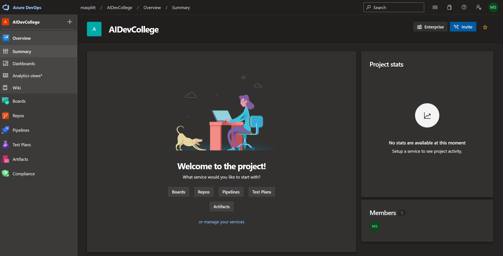

### Work with Azure Repos


### Import the Azure Developer College GitHub repository to your Azure Repo

Open your browser and navigate to the [AI Developer College Training Days on GitHub](https://github.com/aidevcollege/aidevcollege.git). Click the green "Code" button and copy the
https url.


Go to your Azure DevOps project import the repository and name it *aidevcollege*:


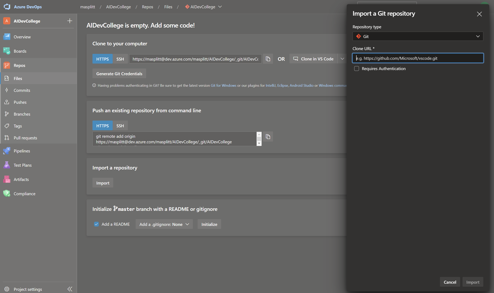

### Optional: Clone the repository to your local machine, use SSH key authentication

SSH public key authentication works with an asymmetric pair of generated encryption keys. The public key is shared with Azure DevOps and used to verify the initial ssh connection. The private key is kept safe and secure on your system.

If you haven't already created an SSH key on your system, please follow these steps [here](https://docs.microsoft.com/en-us/azure/devops/repos/git/use-ssh-keys-to-authenticate?view=azure-devops&tabs=current-page#step-1-create-your-ssh-keys).

After you have created the SSH key for your system, add the public key to Azure DevOps services.
Follow these steps described [here](https://docs.microsoft.com/en-us/azure/devops/repos/git/use-ssh-keys-to-authenticate?view=azure-devops&tabs=current-page#step-2--add-the-public-key-to-azure-devops-servicestfs).

Now that you have added your SSH public key to Azure DevOps, you are ready to clone the Azure Developer College's repository to your local machine.

Open a shell and go to your project's folder and clone the repository as described [here](https://docs.microsoft.com/en-us/azure/devops/repos/git/use-ssh-keys-to-authenticate?view=azure-devops&tabs=current-page#step-3-clone-the-git-repository-with-ssh) to your local machine.


### Add Service Connections to your DevOps project

Next, we configure the project such that the release pipeline has access to the code in github repo, to your AzureML Workspace, and to the Azure Container Registry (for Docker images).

Go to the settings of your project, `Service Connections` and click on `New Service Connection`.

- Create one Service Connection of type `Azure Resource Manager`.
- Create a service principle of the type `Service Principle (automatic)`. 
- Select your `Subscription` and name it `MyAzureSubscription` in the *Service connection name*.

<p align="left"></p>

First you select `Azure Resource Manager` in the first screen:

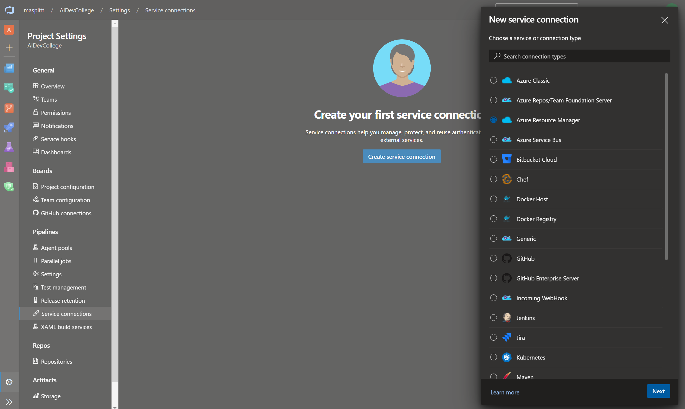

In the next screen you select `service principal (automatic)`

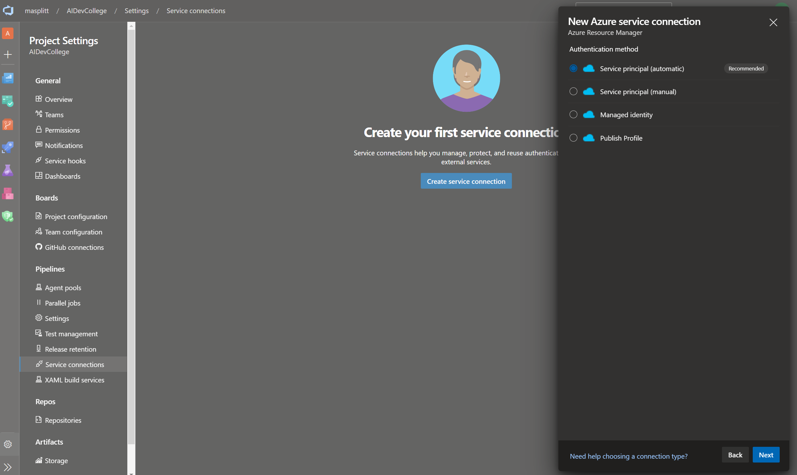

In the next screen you select your *Subscription* and fill in `MyAzureSubscription` in the *Service connection name*.

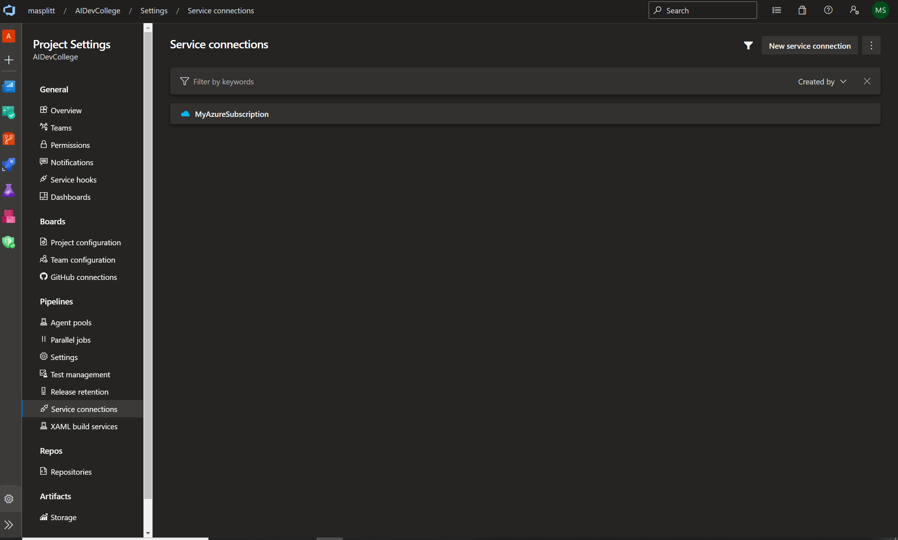


### Build and Release Pipeline

Now we can look at the build and the Release pipeline for the project by selecting __azure-pipelines.yml__ under _Azure Repos_ in the __MLOps Folder__ in the Azure DevOps project. 

<p align="left"></p>

Now let's look at the Pipeline it consists out of a:
- `Train, Evaluate and Register` *Dev* Stage,
- `Deploy to Staging` *Test* Stage and a 
- `Deploy to Production` *Production* Stage.

**Summarizing the Steps:**
A Machine Learning model will be trained, evaluated and registered. Afterwards it will be deployed to a Azure Container Instance and finally it will be deployed to the Azure Kubernetes Service.

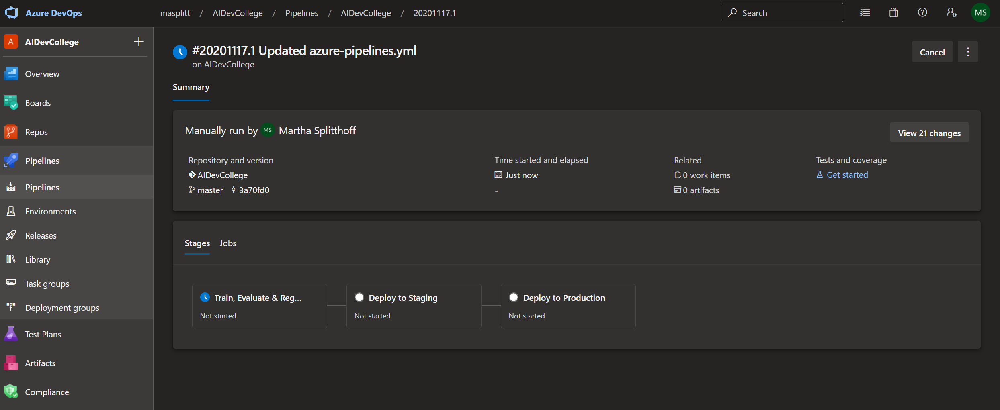

Let's look at the pipeline:

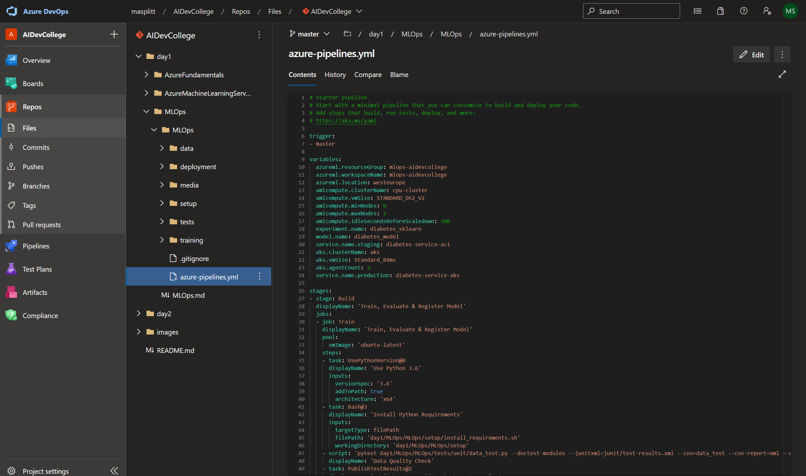

> **Important:** To run the pipeline we will have to change something in the **master** branch of our Repository as it triggers the build process of the pipeline. So go ahead and change the value for the variable *azureml.resourceGroup* to `<yourname>-aidevcollege`. 

```
    variables:
        azureml.resourceGroup: <yourname>-aidevcollege
        azureml.workspaceName: mlops-aidevcollege
        azureml.location: westeurope
        amlcompute.clusterName: cpu-cluster
        amlcompute.vmSize: STANDARD_DS2_V2 
```
This should be the result when the pipeline was executed successfully.

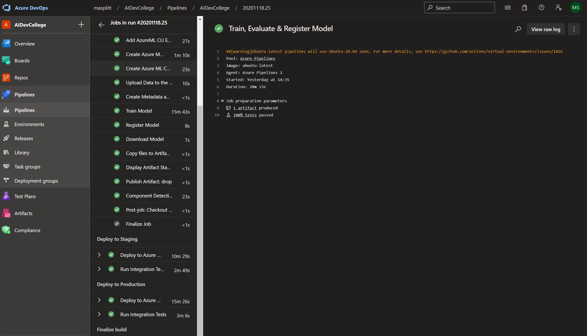

Here you can see when the pipeline ran through all three stages successfully.


In the `Train, Evaluate and Register` *Dev* Stage:
- the dependencies are installed
- the Azure Machine Learning Workspace is deployed
- the Azure Machine Learning CPU-Cluster is deployed
- the Data is uploaded
- the Machine Learning model is trained, registered and downloaded
- the trained model is published as an artifact

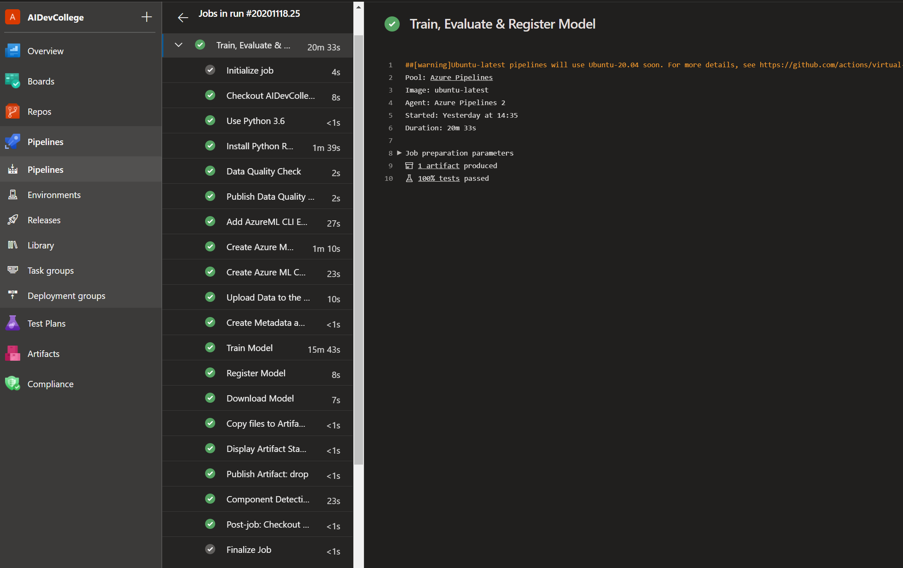

You can see the steps in `jobs`, `steps` and `tasks` in the __azure-pipelines.yml__ file:

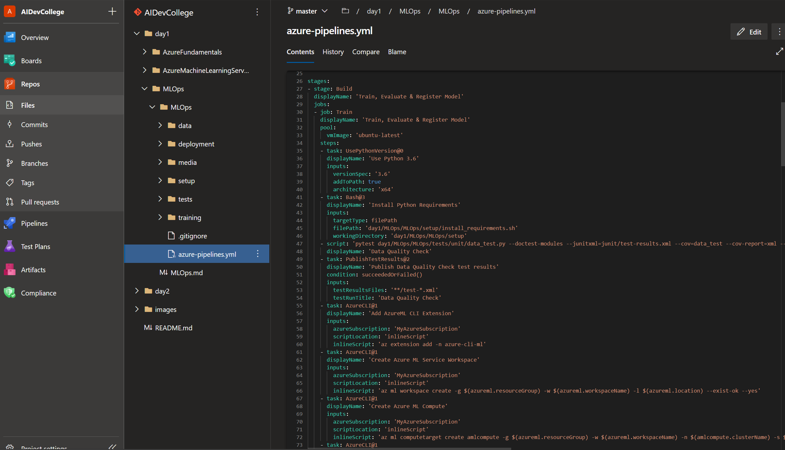


In the `Deploy to Staging` *Test* Stage:
- the Artifact is downloaded
- Dependencies are installed
- Deployment to the Azure Container Instance Service is executed.
- Integration Tests are run

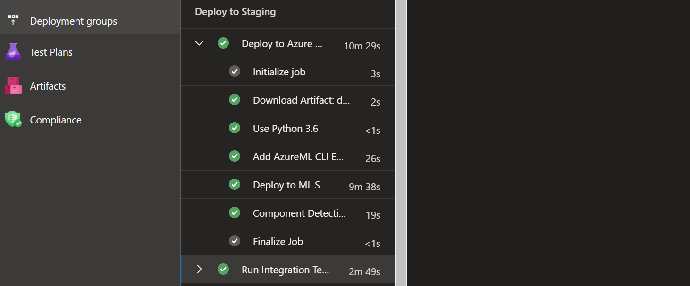

You can see the steps in `jobs`, `steps` and `tasks` in the __azure-pipelines.yml__ file:

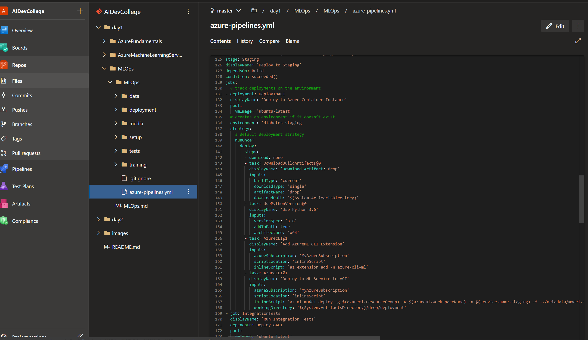

In the `Deploy to Production` *Production* Stage:
- the Artifact is downloaded
- Dependencies are installed
- Deployment to the Azure Container Instance Service is executed.
- Integration Tests are run

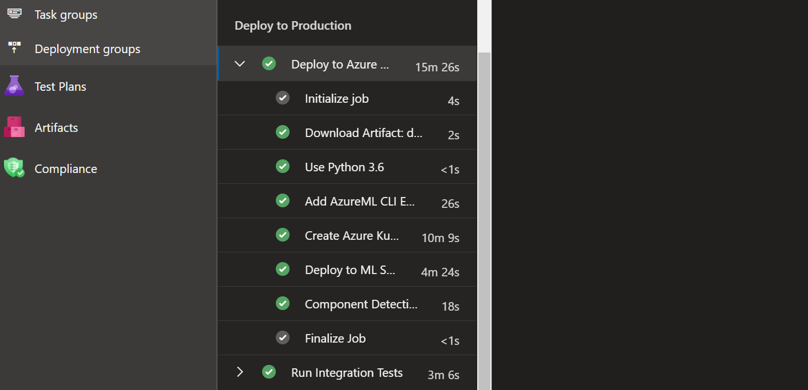

You can see the steps in `jobs`, `steps` and `tasks` in the __azure-pipelines.yml__ file:

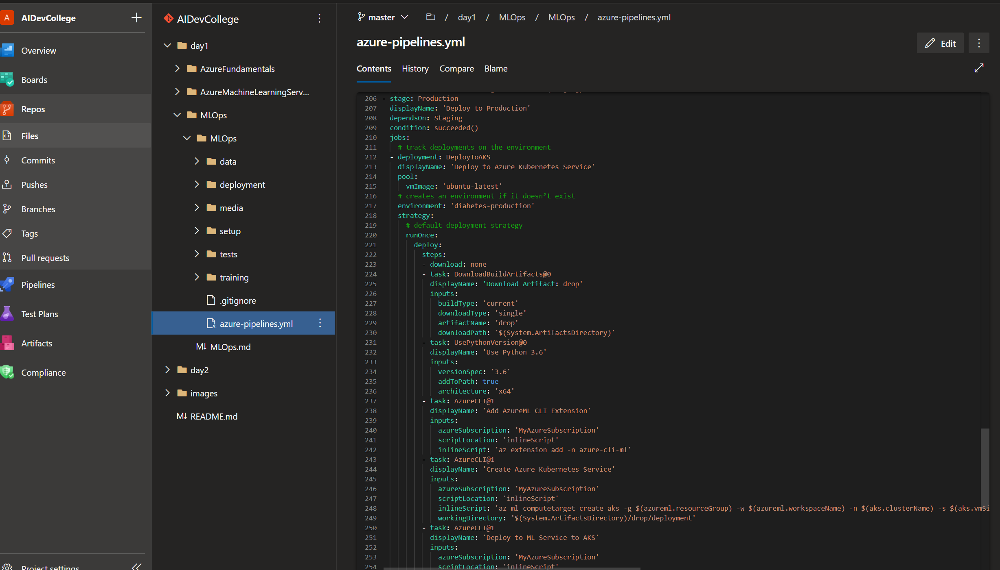

Finally, check your Resource Group within the **Azure Portal**, if everything has been deployed and check your **Machine Learning Workspace** to see the **trained model** and the **endpoints**. 

Here you can see the final results within the **Azure Portal**:

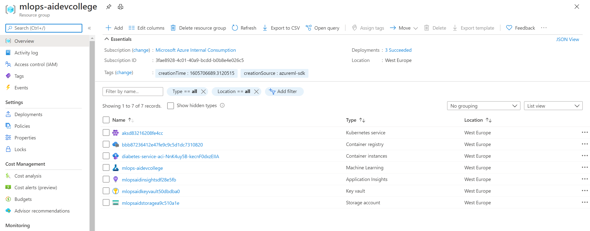

Here you can see the final results within the **Azure Machine Learning Workspace**:
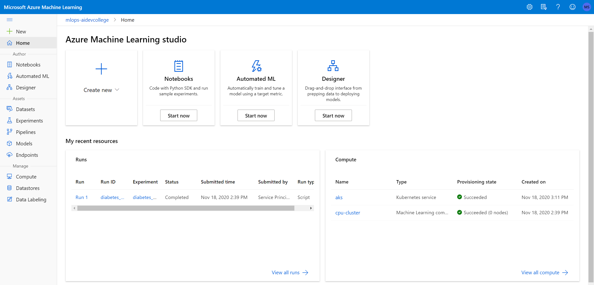

> **Important:** If you want to know more about Azure DevOps there is another Azure Developer College going into the details of Azure Devops (https://github.com/azuredevcollege/trainingdays/tree/master/day4)

#### Additional References

You can install the MLOps extension from here: [https://marketplace.visualstudio.com/items?itemName=ms-air-aiagility.vss-services-azureml](https://marketplace.visualstudio.com/items?itemName=ms-air-aiagility.vss-services-azureml). This will allow you to connect your TinyYOLO model to your pipeline.