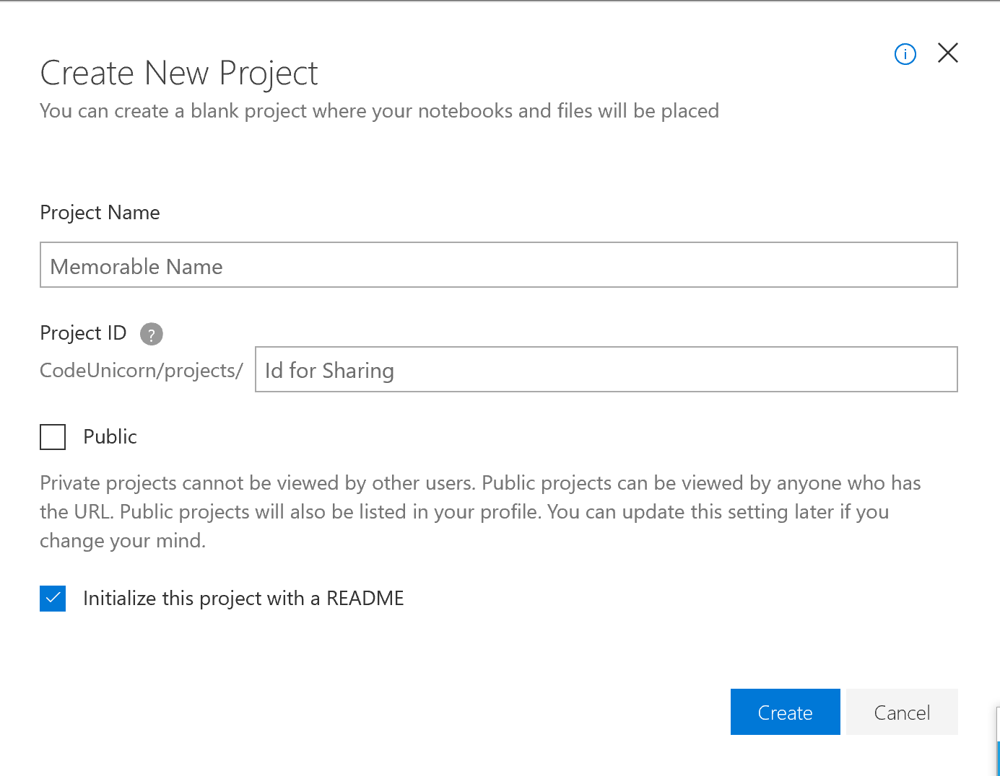
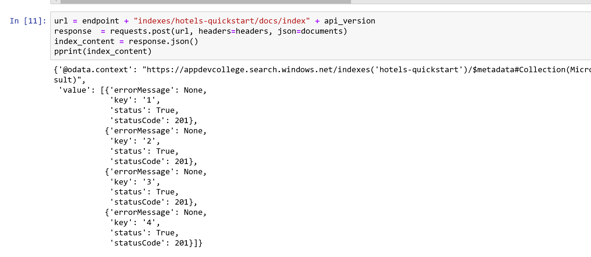
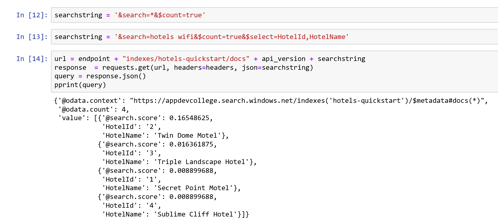
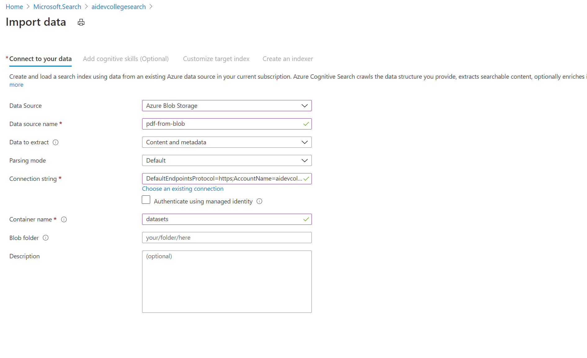
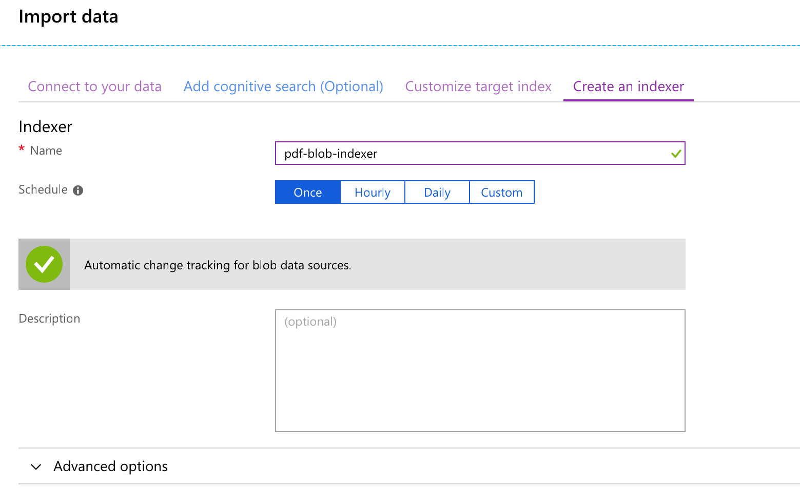
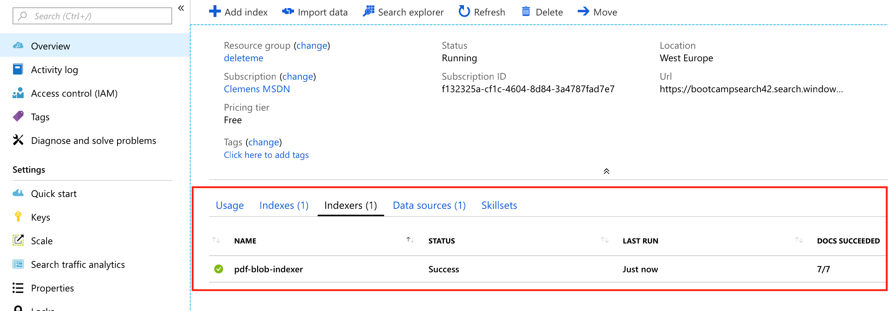
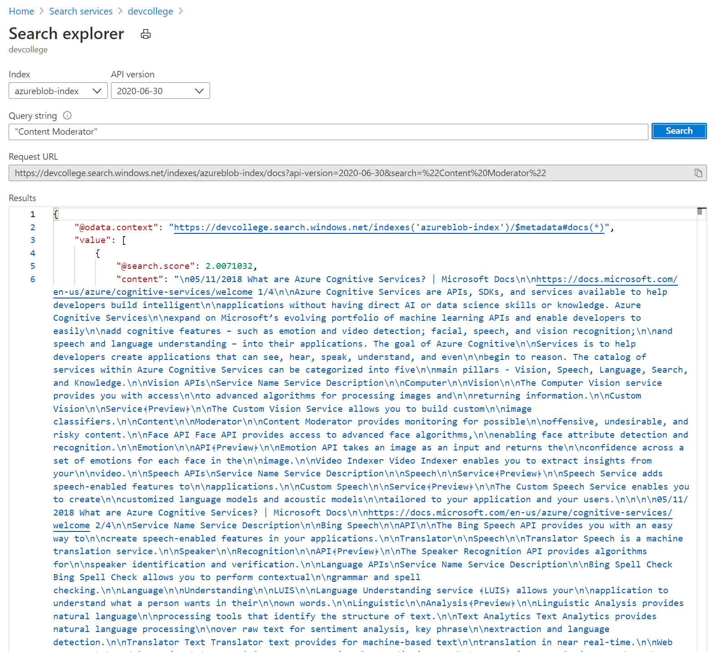
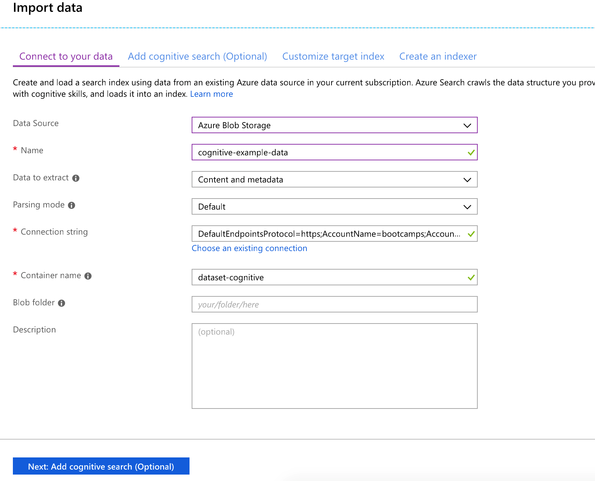

# Azure (Cognitive) Search #

## Create an Azure Cognitive Search index in Python using Jupyter notebooks ##

## Get a key and URL ##

REST calls require the service URL and an access key on every request. A search service is created with both, so if you added Azure Cognitive Search to your subscription, follow these steps to get the necessary information:

1. [Sign in to the Azure portal](https://portal.azure.com/), and in your search service **Overview** page, get the URL. An example endpoint might look like `https://mydemo.search.windows.net`.

2. In **Settings** > **Keys**, get an admin key for full rights on the service. There are two interchangeable admin keys, provided for business continuity in case you need to roll one over. You can use either the primary or secondary key on requests for adding, modifying, and deleting objects.

All requests require an api-key on every request sent to your service. Having a valid key establishes trust, on a per request basis, between the application sending the request and the service that handles it.

## Connect to Azure Cognitive Search

In this task, start a Jupyter notebook and verify that you can connect to Azure Cognitive Search. You'll do this by requesting a list of indexes from your service. On Windows with Anaconda3, you can use Anaconda Navigator to launch a notebook.

0. Register here [Azure Notebooks](https://notebooks.azure.com)
1. Create a project 
    

    

2. Create a notebook
   

3. Create a new Python3.6 notebook.
   

4. In the first cell, load the libraries used for working with JSON and formulating HTTP requests.

   ```python
   import json
   import requests
   from pprint import pprint
   ```

5. In the second cell, input the request elements that will be constants on every request. Replace the search service name (YOUR-SEARCH-SERVICE-NAME) and admin API key (YOUR-ADMIN-API-KEY) with valid values. 

   ```python
   endpoint = 'https://<YOUR-SEARCH-SERVICE-NAME>.search.windows.net/'
   api_version = '?api-version=2019-05-06'
   headers = {'Content-Type': 'application/json',
           'api-key': '<YOUR-ADMIN-API-KEY>' }
   ```

   If you get ConnectionError `"Failed to establish a new connection"`, verify that the api-key is a primary or secondary admin key, and that all leading and trailing characters (`?` and `/`) are in place.

6. In the third cell, formulate the request. This GET request targets the indexes collection of your search service and selects the name property of existing indexes.

   ```python
   url = endpoint + "indexes" + api_version + "&$select=name"
   response  = requests.get(url, headers=headers)
   index_list = response.json()
   pprint(index_list)
   ```

7. Run each step. If indexes exist, the response contains a list of index names. In the screenshot below, the service already has an azureblob-index and a realestate-us-sample index.

   In contrast, an empty index collection returns this response: `{'@odata.context': 'https://mydemo.search.windows.net/$metadata#indexes(name)', 'value': []}`

## 1 - Create an index

Unless you are using the portal, an index must exist on the service before you can load data. This step uses the [Create Index REST API](https://docs.microsoft.com/rest/api/searchservice/create-index) to push an index schema to the service.

Required elements of an index include a name, a fields collection, and a key. The fields collection defines the structure of a *document*. Each field has a name, type, and attributes that determine how the field is used (for example, whether it is full-text searchable, filterable, or retrievable in search results). Within an index, one of the fields of type `Edm.String` must be designated as the *key* for document identity.

This index is named "hotels-quickstart" and has the field definitions you see below. It's a subset of a larger [Hotels index](https://github.com/Azure-Samples/azure-search-sample-data/blob/master/hotels/Hotels_IndexDefinition.JSON) used in other walkthroughs. We trimmed it in this quickstart for brevity.

1. In the next cell, paste the following example into a cell to provide the schema. 

    ```python
    index_schema = {
       "name": "hotels-quickstart",  
       "fields": [
         {"name": "HotelId", "type": "Edm.String", "key": "true", "filterable": "true"},
         {"name": "HotelName", "type": "Edm.String", "searchable": "true", "filterable": "false", "sortable": "true", "facetable": "false"},
         {"name": "Description", "type": "Edm.String", "searchable": "true", "filterable": "false", "sortable": "false", "facetable": "false", "analyzer": "en.lucene"},
         {"name": "Description_fr", "type": "Edm.String", "searchable": "true", "filterable": "false", "sortable": "false", "facetable": "false", "analyzer": "fr.lucene"},
         {"name": "Category", "type": "Edm.String", "searchable": "true", "filterable": "true", "sortable": "true", "facetable": "true"},
         {"name": "Tags", "type": "Collection(Edm.String)", "searchable": "true", "filterable": "true", "sortable": "false", "facetable": "true"},
         {"name": "ParkingIncluded", "type": "Edm.Boolean", "filterable": "true", "sortable": "true", "facetable": "true"},
         {"name": "LastRenovationDate", "type": "Edm.DateTimeOffset", "filterable": "true", "sortable": "true", "facetable": "true"},
         {"name": "Rating", "type": "Edm.Double", "filterable": "true", "sortable": "true", "facetable": "true"},
         {"name": "Address", "type": "Edm.ComplexType", 
         "fields": [
         {"name": "StreetAddress", "type": "Edm.String", "filterable": "false", "sortable": "false", "facetable": "false", "searchable": "true"},
         {"name": "City", "type": "Edm.String", "searchable": "true", "filterable": "true", "sortable": "true", "facetable": "true"},
         {"name": "StateProvince", "type": "Edm.String", "searchable": "true", "filterable": "true", "sortable": "true", "facetable": "true"},
         {"name": "PostalCode", "type": "Edm.String", "searchable": "true", "filterable": "true", "sortable": "true", "facetable": "true"},
         {"name": "Country", "type": "Edm.String", "searchable": "true", "filterable": "true", "sortable": "true", "facetable": "true"}
        ]
       }
      ]
    }
    ```

2. In another cell, formulate the request. This PUT request targets the indexes collection of your search service and creates an index based on the index schema you provided in the previous cell. Check that the indentation is correct as shown below.

   ```python
   url = endpoint + "indexes" + api_version
   response  = requests.post(url, headers=headers, json=index_schema)
   index = response.json()
   pprint(index)
   ```

3. Run each step.

   The response includes the JSON representation of the schema. 

- Another way to verify index creation is to check the Indexes list in the portal.

<a name="load-documents"></a>

## 2 - Load documents

To push documents, use an HTTP POST request to your index's URL endpoint. The REST API is [Add, Update, or Delete Documents](https://docs.microsoft.com/rest/api/searchservice/addupdate-or-delete-documents). Documents originate from [HotelsData](https://github.com/Azure-Samples/azure-search-sample-data/blob/master/hotels/HotelsData_toAzureSearch.JSON) on GitHub.

1. In a new cell, provide four documents that conform to the index schema. Specify an upload action for each document.

    ```python
    documents = {
        "value": [
        {
        "@search.action": "upload",
        "HotelId": "1",
        "HotelName": "Secret Point Motel",
        "Description": "The hotel is ideally located on the main commercial artery of the city in the heart of New York. A few minutes away is Time's Square and the historic centre of the city, as well as other places of interest that make New York one of America's most attractive and cosmopolitan cities.",
        "Description_fr": "L'hôtel est idéalement situé sur la principale artère commerciale de la ville en plein cœur de New York. A quelques minutes se trouve la place du temps et le centre historique de la ville, ainsi que d'autres lieux d'intérêt qui font de New York l'une des villes les plus attractives et cosmopolites de l'Amérique.",
        "Category": "Boutique",
        "Tags": [ "pool", "air conditioning", "concierge" ],
        "ParkingIncluded": "false",
        "LastRenovationDate": "1970-01-18T00:00:00Z",
        "Rating": 3.60,
        "Address": {
            "StreetAddress": "677 5th Ave",
            "City": "New York",
            "StateProvince": "NY",
            "PostalCode": "10022",
            "Country": "USA"
            }
        },
        {
        "@search.action": "upload",
        "HotelId": "2",
        "HotelName": "Twin Dome Motel",
        "Description": "The hotel is situated in a  nineteenth century plaza, which has been expanded and renovated to the highest architectural standards to create a modern, functional and first-class hotel in which art and unique historical elements coexist with the most modern comforts.",
        "Description_fr": "L'hôtel est situé dans une place du XIXe siècle, qui a été agrandie et rénovée aux plus hautes normes architecturales pour créer un hôtel moderne, fonctionnel et de première classe dans lequel l'art et les éléments historiques uniques coexistent avec le confort le plus moderne.",
        "Category": "Boutique",
        "Tags": [ "pool", "free wifi", "concierge" ],
        "ParkingIncluded": "false",
        "LastRenovationDate": "1979-02-18T00:00:00Z",
        "Rating": 3.60,
        "Address": {
            "StreetAddress": "140 University Town Center Dr",
            "City": "Sarasota",
            "StateProvince": "FL",
            "PostalCode": "34243",
            "Country": "USA"
            }
        },
        {
        "@search.action": "upload",
        "HotelId": "3",
        "HotelName": "Triple Landscape Hotel",
        "Description": "The Hotel stands out for its gastronomic excellence under the management of William Dough, who advises on and oversees all of the Hotel’s restaurant services.",
        "Description_fr": "L'hôtel est situé dans une place du XIXe siècle, qui a été agrandie et rénovée aux plus hautes normes architecturales pour créer un hôtel moderne, fonctionnel et de première classe dans lequel l'art et les éléments historiques uniques coexistent avec le confort le plus moderne.",
        "Category": "Resort and Spa",
        "Tags": [ "air conditioning", "bar", "continental breakfast" ],
        "ParkingIncluded": "true",
        "LastRenovationDate": "2015-09-20T00:00:00Z",
        "Rating": 4.80,
        "Address": {
            "StreetAddress": "3393 Peachtree Rd",
            "City": "Atlanta",
            "StateProvince": "GA",
            "PostalCode": "30326",
            "Country": "USA"
            }
        },
        {
        "@search.action": "upload",
        "HotelId": "4",
        "HotelName": "Sublime Cliff Hotel",
        "Description": "Sublime Cliff Hotel is located in the heart of the historic center of Sublime in an extremely vibrant and lively area within short walking distance to the sites and landmarks of the city and is surrounded by the extraordinary beauty of churches, buildings, shops and monuments. Sublime Cliff is part of a lovingly restored 1800 palace.",
        "Description_fr": "Le sublime Cliff Hotel est situé au coeur du centre historique de sublime dans un quartier extrêmement animé et vivant, à courte distance de marche des sites et monuments de la ville et est entouré par l'extraordinaire beauté des églises, des bâtiments, des commerces et Monuments. Sublime Cliff fait partie d'un Palace 1800 restauré avec amour.",
        "Category": "Boutique",
        "Tags": [ "concierge", "view", "24-hour front desk service" ],
        "ParkingIncluded": "true",
        "LastRenovationDate": "1960-02-06T00:00:00Z",
        "Rating": 4.60,
        "Address": {
            "StreetAddress": "7400 San Pedro Ave",
            "City": "San Antonio",
            "StateProvince": "TX",
            "PostalCode": "78216",
            "Country": "USA"
            }
        }
    ]
    }
    ```   

2. In another cell, formulate the request. This POST request targets the docs collection of the hotels-quickstart index and pushes the documents provided in the previous step.

   ```python
   url = endpoint + "indexes/hotels-quickstart/docs/index" + api_version
   response  = requests.post(url, headers=headers, json=documents)
   index_content = response.json()
   pprint(index_content)
   ```

3. Run each step to push the documents to an index in your search service. Results should look similar to the following example. 

    

## 3 - Search an index

This step shows you how to query an index using the [Search Documents REST API](https://docs.microsoft.com/rest/api/searchservice/search-documents).

1. In a cell, provide a query expression that executes an empty search (search=*), returning an unranked list (search score  = 1.0) of arbitrary documents. By default, Azure Cognitive Search returns 50 matches at a time. As structured, this query returns an entire document structure and values. Add $count=true to get a count of all documents in the results.

   ```python
   searchstring = '&search=*&$count=true'
   ```

2. In a new cell, provide the following example to search on the terms "hotels" and "wifi". Add $select to specify which fields to include in the search results.

   ```python
   searchstring = '&search=hotels wifi&$count=true&$select=HotelId,HotelName'
   ```

3. In another cell, formulate a request. This GET request targets the docs collection of the hotels-quickstart index, and attaches the query you specified in the previous step.

   ```python
   url = endpoint + "indexes/hotels-quickstart/docs" + api_version + searchstring
   response  = requests.get(url, headers=headers, json=searchstring)
   query = response.json()
   pprint(query)
   ```

4. Run each step. Results should look similar to the following output. 

    

5. Try a few other query examples to get a feel for the syntax. You can replace the `searchstring` with the following examples and then rerun the search request. 

   Apply a filter: 

   ```python
   searchstring = '&search=*&$filter=Rating gt 4&$select=HotelId,HotelName,Description,Rating'
   ```

   Take the top two results:

   ```python
   searchstring = '&search=boutique&$top=2&$select=HotelId,HotelName,Description,Category'
   ```

    Order by a specific field:

   ```python
   searchstring = '&search=pool&$orderby=Address/City&$select=HotelId, HotelName, Address/City, Address/StateProvince, Tags'
   ```

### Azure Search & Cognitive Search

:triangular_flag_on_post: **Goal:** Deploy an Azure Search instance and index a PDF-based data set 

1. Deploy an [Azure Search](https://docs.microsoft.com/en-us/azure/search/search-create-service-portal) instance
1. Index the unstructured PDF data set from [here](data/search-dataset-pdf.zip) - which document contains the term `Content Moderator`?

:question: **Questions:** 

1. What is an Index? What is an Indexer? What is a Data Source? How do they relate to each other?
1. Why would you want to use replicas? Why would you want more partitions?
1. How would you index `json` documents sitting in Azure Blob?

:triangular_flag_on_post: **Goal:** Index an unstructured data set with Cognitive Search

1. Add another index to the Azure Search instance, but this time enable Cognitive Search
1. Index an existing data set coming from `Azure Blob` (data set can be downloaded [here](data/search-dataset-cognitive.zip)) - which document contains the term `Pin to Dashboard`?

:question: **Questions:** 

1. Let's assume we've built a Machine Learning model that can detect beer glasses images (we'll do that in the next challenge) - how could we leverage this model directly in Azure Search for tagging our data?

## Indexing PDF data

First, create a `Azure Search` instance in the Azure Portal:


For our purposes, the `Free Tier` is sufficient:


However, the `Free Tier` does not support additional replicas, scaling and is only able to index documents with up to 32000 characters/document. If we want to index longer documents, we need to go to a bigger tier (64000 for `Basic`, 4m for `Standard` and above - as of November 2018).

Once provisioned, our service will be reachable via `https://xxxxxxx.search.windows.net`

Azure Search [can index](https://docs.microsoft.com/en-us/azure/search/search-indexer-overview) data from a variety of sources:

* Azure SQL Database or SQL Server on an Azure virtual machine
* Azure Cosmos DB
* Azure Blob Storage
* Azure Table Storage
* Indexing CSV blobs using the Azure Search Blob indexer
* Indexing JSON blobs with Azure Search Blob indexer

In our case, we'll upload our data to Blob Storage and let Azure Search index it from there. Hence, we need to create an new `Storage Account` and create a new `Blob container`, where we'll upload our [dataset](../data/search-dataset-pdf.zip) to. We can do this completely through the Azure Portal, use [Storage Explorer](https://azure.microsoft.com/en-us/features/storage-explorer/) or use the API/CLI.

Once we have uploaded the PDF files, we can go into our Azure Search instance and goto `Import Data`:


Next, we need to define the `Data Source`:



We'll skip `Cognitive Search` for this example (we'll get back to it soon). Azure Search automatically looks at the Blob container and will now extract the content and the metadata from all the PDFs. Let's give our Index a better name:


:question: Question: Does it make sense to have any of the fields `Filterable`, `Sortable`, or `Facetable`?

Lastly, we need to give our Indexer a name and also set the schedule. In our case, we'll only run it once, but in a real world scenario, we might want to keep it running to index new, incoming data:



After a minute or two, our Indexer will have indexed all the PDFs and we should be able to query them.



## Querying Content

Azure Search now indexed all our PDFs via the `pdf-blob-indexer` into the `pdf-index` index. Ideally, we would use the REST API of Azure Search to perform sophisticated queries, but in our case, we can use the `Azure Search Explorer`:


[Querying data](https://docs.microsoft.com/en-us/azure/search/search-query-overview) in Azure Search can get quite sophisticated, but for our example here, we can just put in a simple query:



Using double-quotes `"..."` will search for the whole string, rather than each substring. If we want to make a search term mandatory, we need to prefix a `+`. There is a billion more things we can do, but for now, we'll see that we get one document back, as one only one PDF contained the term `Content Moderator`:

```json
{
    "@odata.context": "https://bootcampsearch42.search.windows.net/indexes('pdf-index')/$metadata#docs",
    "value": [
        {
            "@search.score": 0.16848493,
            "content": "\n05/11/2018 What are Azure Cognitive Services? | Microsoft Docs\n\nhttps://docs.microsoft.com/en-us/azure/cognitive-services/welcome 1/4\n\nAzure Cognitive Services are APIs, SDKs, and services available to help developers build intelligent\n\napplications ...",
            "metadata_storage_path": "aHR0cHM6Ly9ib290Y2FtcHMuYmxvYi5jb3JlLndpbmRvd3MubmV0L2RhdGFzZXRzL1doYXQlMjBhcmUlMjBBenVyZSUyMENvZ25pdGl2ZSUyMFNlcnZpY2VzLnBkZg2"
        }
    ]
}
```

If we want to figure out the original file, we can look at: `metadata_storage_path`. Since it is base64-encoded, we need to decode it, either via command line or by using e.g., [www.base64decode.org](https://www.base64decode.org/):

```
https://bootcamps.blob.core.windows.net/datasets/What%20are%20Azure%20Cognitive%20Services.pdf
```

Perfect, now we know which document contained the term `Content Moderator`.

## Indexing unstructured content (e.g. images, audio, etc.)

In the first part, we've seen that Azure Search can index data like PDFs, PowerPoints, etc., as long as the documents are easily machine readable (=text). [Azure Cognitive Search](https://docs.microsoft.com/en-us/azure/search/cognitive-search-concept-intro) allows us to also index unstructured data. More precisely, it add capabilities for data extraction, natural language processing (NLP), and image processing to Azure Search indexing pipeline (for more see [here](https://docs.microsoft.com/en-us/azure/search/cognitive-search-concept-intro#key-features-and-concepts)). In Azure Cognitive Search, a skillset responsible for the pipeline of the data and consists of multiple skills. Some skills have been pre-included, but it is also possible for us to write our own skills.

[Azure Cognitive Search](https://docs.microsoft.com/en-us/azure/search/cognitive-search-quickstart-blob)

As before, let's upload our data to Blob Storage and let Azure Search index it from there - in a separate index obviously. In our existing Storage Account, we'll create a new `Blob container`, where we'll upload our [dataset](../data/search-dataset-cognitive.zip) to.

Once we're done, we'll repeat the steps from before, `Import Dataset`, walk through the wizard, but this time, we'll configure the `Cognitive Search` part in the second tab.



Next, we need to define the skillset. In our case, we'll enable all features:


We might not want to make our `content` field retrievable, as it does not necessarily provide a lot of value - however, we want to keep it `searchable`, so that Azure Search can do its job. Since we have the original files in Blob and the location stored in `metadata_storage_path`, we can always just retrieve the original file.

Once we finished the next two tabs, Azure Cognitive Search will start indexing our data (this will take a bit longer, as it needs to run image recognition, OCR, etc. on the files). We might see some error, which should be expected:

```json
{
  "key": "https://xxxxxxx.blob.core.windows.net/dataset-cognitive/10-K-FY16.html",
  "message": "Truncated extracted text to 32768 characters."
}
```

Thank you `Free Tier` for only allowing 32768 characters per document...

Let's try some search queries:

* `"Pin to Dashboard"` --> returns `create-search-service.png` (text was recognized via OCR)
* `"Charlotte"` --> returns `MSFT_cloud_architecture_contoso.pdf` (location was recognized via OCR in image)

Good, so looks like our skillset worked. Please note that ideally we'd query through the API an directly specify the relevant fields, e.g., `location:Charlotte` in the second example:

* [Simple Query Syntax](https://docs.microsoft.com/en-us/rest/api/searchservice/simple-query-syntax-in-azure-search)
* [Lucene Query Syntax](https://docs.microsoft.com/en-us/rest/api/searchservice/lucene-query-syntax-in-azure-search)

## Using the API

We've been lazy and did everything through the portal - obviously not the way we want to work in the real world. Especially data ingestion and search should (and most likely needs) to be performed through the API. Luckily, the API is pretty easy to use (even using `curl` for it is easy):

* [Create an index](https://docs.microsoft.com/en-us/azure/search/search-create-index-rest-api)
* [Import Data](https://docs.microsoft.com/en-us/azure/search/search-import-data-rest-api)
* [Search](https://docs.microsoft.com/en-us/azure/search/search-query-rest-api)

For sake of time today we won't be able to go into more detail here, but feel free to have a look at it.


## Optional: Play around a bit with Azure Search 

- https://azjobsdemo.azurewebsites.net/
- https://docs.microsoft.com/en-us/samples/azure-samples/search-dotnet-asp-net-mvc-jobs/search-dotnet-asp-net-mvc-jobs/
