# Cognitive Services #

In this repository you will find the materials and challenges for the Azure Cognitive Services.

The associated training teaches you how to deploy and use the following two Azure technology:

* [Azure Cognitive Services](https://azure.microsoft.com/en-us/services/cognitive-services/)

# What are Azure Cognitive Services?

Azure Cognitive Services: 
- are APIs, SDKs and services available to help developers build intelligent applications without having direct Artificial Intelligence (AI), data science skills or knowledge. 
- enable developers to easily add cognitive features into their applications. 
- The goal of Azure Cognitive Services is to help developers create applications that can see, hear, speak, understand and even begin to reason. 
- The catalog of services within Azure Cognitive Services can be categorized into five main pillars - *Vision*, *Speech*, *Language*, *Web Search*, and *Decision*.


We'll touch on the following services:

|Service|Where?|
|---|---|
|Azure Search + Cognitive Search|[Azure Search + Cognitive Search](https://azure.microsoft.com/en-us/services/search/)|
|Computer Vision API and Custom Vision Service |[Computer Vision API](https://azure.microsoft.com/en-us/services/cognitive-services/computer-vision/)|
|Speech Services|[Speech Services](https://azure.microsoft.com/en-us/services/cognitive-services/speech-services/)|
|Language Understanding|[Language Understanding](https://azure.microsoft.com/en-us/services/cognitive-services/language-understanding-intelligent-service/)|
|Text Analytics API|[Text Analytics API](https://azure.microsoft.com/en-us/services/cognitive-services/text-analytics/)|
|Search API|[Search API](https://azure.microsoft.com/en-us/services/cognitive-services/directory/search/)|

# Challenges

You can solve these tasks in a programming language of your choice. For sake of convenience, we are providing hints in `Python`, which you can easily run on the `Compute VM from the Azure Machine Learning Service` or in `Visual Studio Code`. SDK Support for `C#` or `.NET Core` is available for most challenges. Especially Azure Search features an easy-to-use `.NET SDK`. You can find code examples in the Azure documentation for the associated services.

Today we will cover the following topics in several sections:

|Topic|Section|
|---|---|
|Text Analytics |[Azure Cognitive Services - Text Analytics](#azure-cognitive-services---text-analytics)|
|Translate Text|[Azure Cognitive Services - Translate Text](#azure-cognitive-services---translate-text)|
|Face|[Azure Cognitive Services - Face](#azure-cognitive-services---face)|
|Computer Vision|[Azure Cognitive Services - Computer Vision Service](#azure-cognitive-services---computer-vision-service)|
|Custom Vision|[Azure Cognitive Services - Custom Vision Service for Detecting Objects in Images](#azure-cognitive-services---custom-vision-service-for-detecting-objects-in-images)|
|Speech|[Azure Cognitive Services - Speech](#azure-cognitive-services---speech)|
|Language||[Azure Cognitive Services - Language - Reveal the intention of the text](#azure-cognitive-services---language---reveal-the-intention-of-the-text)|
|Search|[Azure Cognitive Services - Search](#azure-cognitive-services---search)|


## Azure Cognitive Services - Text Analytics

|Azure Cognitive Services|Information|
|---|---|
|[Text Analytics API](https://azure.microsoft.com/en-us/services/cognitive-services/text-analytics/)|https://docs.microsoft.com/en-us/azure/cognitive-services/text-analytics/quickstarts/python|

:triangular_flag_on_post: **Goal:** Leverage Text Analytics API for extracting language, sentiment, key phrases, and entities from text

In the language of your choice (Python solution is provided), write a small scripts that
[Text Analytics Service with Other Programming Languages](https://docs.microsoft.com/en-us/azure/cognitive-services/Text-Analytics/quickstarts/nodejs)

In this task, start a Jupyter notebook and verify that you can connect to Azure Cognitive Search. You'll do this by requesting a list of indexes from your service. On Windows with Anaconda3, you can use Anaconda Navigator to launch a notebook.

1. We reuse the `Compute VM` from the __Azure Machine Learning Service__ and create a new Notebook. We can click the `New` button and create a new Notebook of type: `Python 3.6 - AzureML`. A new browser tab should open up and we can click the name `Untitled` and rename it to `CognitiveServices.ipynb`.

Let's start with connecting to your Text Analytics Service. Get the Key and the URL from the Azure portal :

```python
import requests
from pprint import pprint

subscription_key = "xxx" # Paste your API key here
text_analytics_base_url = "xxx" # Paste your URL in here
headers = {"Ocp-Apim-Subscription-Key": subscription_key}
```
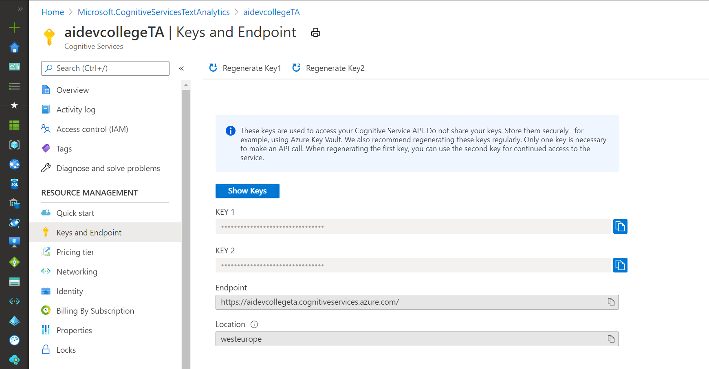

### Detect Language

Firstly, we can extract the language from text. Run this in your Azure Notebook:

```python
language_api_url = text_analytics_base_url + "/text/analytics/v2.1/languages"

documents = { "documents": [
    { "id": "1", "text": "This is a document written in English." },
    { "id": "2", "text": "Este es un document escrito en Español." },
    { "id": "3", "text": "这是一个用中文写的文件" }
]}

response  = requests.post(language_api_url, headers=headers, json=documents)
languages = response.json()
pprint(languages)
```
Your result should look like this: 

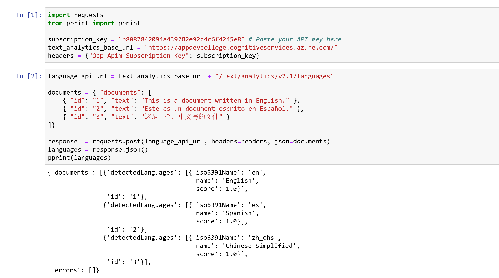

### Detect Sentiment

Secondly, we can detect the sentiment of a given phrase:

```python
sentiment_url = text_analytics_base_url + "/text/analytics/v2.1/sentiment"

documents = {"documents" : [
  {"id": "1", "language": "en", "text": "I had a wonderful experience! The rooms were wonderful and the staff was helpful."},
  {"id": "2", "language": "en", "text": "I had a terrible time at the hotel. The staff was rude and the food was awful."},  
  {"id": "3", "language": "es", "text": "Los caminos que llevan hasta Monte Rainier son espectaculares y hermosos."},  
  {"id": "4", "language": "es", "text": "La carretera estaba atascada. Había mucho tráfico el día de ayer."}
]}

response  = requests.post(sentiment_url, headers=headers, json=documents)
sentiments = response.json()
pprint(sentiments)
```
Example Result: 


### Detect Key Phrases

Thirdly, we can easily detect key phrases from text:

```python
keyphrase_url = text_analytics_base_url + "/text/analytics/v2.1/keyphrases"

documents = {"documents" : [
  {"id": "1", "language": "en", "text": "I had a wonderful experience! The rooms were wonderful and the staff was helpful."},
  {"id": "2", "language": "en", "text": "I had a terrible time at the hotel. The staff was rude and the food was awful."},  
  {"id": "3", "language": "es", "text": "Los caminos que llevan hasta Monte Rainier son espectaculares y hermosos."},  
  {"id": "4", "language": "es", "text": "La carretera estaba atascada. Había mucho tráfico el día de ayer."}
]}

response  = requests.post(keyphrase_url, headers=headers, json=documents)
key_phrases = response.json()
pprint(key_phrases)
```
Example Result: 


### Detect Entities

And last but not least, we can detect the entities in text:

```python
entities_url = text_analytics_base_url + "/text/analytics/v2.1/entities"

documents = {"documents" : [
  {"id": "1", "text": "Microsoft was founded by Bill Gates and Paul Allen on April 4, 1975, to develop and sell BASIC interpreters for the Altair 8800."}
]}

response  = requests.post(entities_url, headers=headers, json=documents)
entities = response.json()
pprint(entities)
```
Example Result: 


If you want to directly create a dashboard within Power BI from the derived results, have a look at [this tutorial](https://docs.microsoft.com/en-us/azure/cognitive-services/text-analytics/tutorials/tutorial-power-bi-key-phrases).

## Azure Cognitive Services - Translate Text

:triangular_flag_on_post: **Goal:** Translation of multiple sentences, detection of one or more input languages to one or several output languages concurrently.

First, create a `Translator Text` API Key in the Azure Portal:


The Translator API  allows to directly access the service by specifying the API key:


Use the same Notebook as before and copy the following code in a cell below the earlier code in the Notebook.

```python
import requests, json

api_key = "xxx" # Paste your API key here
region = "<paste-your-text-translator-service-region here>" # Paste your region here
url = "https://api.cognitive.microsofttranslator.com/translate?api-version=3.0"
headers = {'Ocp-Apim-Subscription-Key': api_key, 'Ocp-Apim-Subscription-Region': region, 'Content-type': 'application/json'}

params = {'to': 'de'}

body = [{'text' : 'I want to order 4 pizza Magarita and 8 beer!'},
        {'text' : 'Please add 42 salads to the order!'}]

response = requests.post(url, headers=headers, params=params, json=body)
print(json.dumps(response.json(), indent=2))
```
Example Result: 

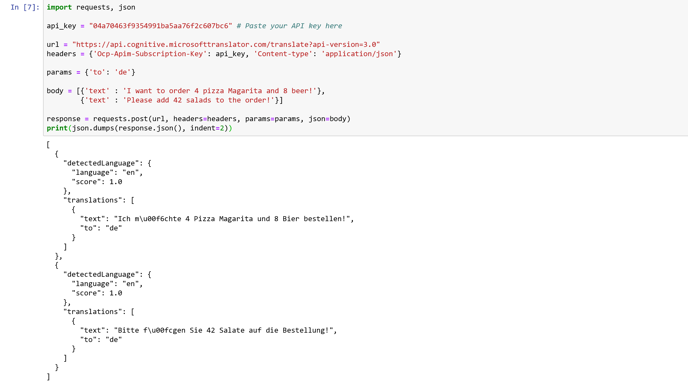

As we can see, we can translate multiple sentences within one API call. The service also automatically detects the input language. If desired, we can even directly translate the input to several output languages concurrently.

## Azure Cognitive Services - Face

:triangular_flag_on_post: **Goal:** Detect, identify, and analyze faces in images.

0. Deploy a Face Api Service in the Portal

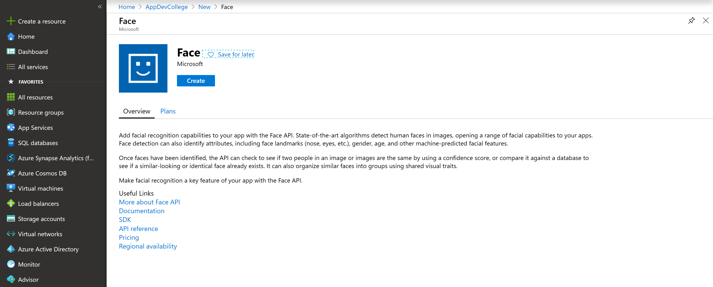


1. Copy the following code into Visual Studio Code.
2. Make the following changes in code where needed:
    1. Replace the value of `subscription_key` with your subscription key.
    2. Edit the value of `face_api_url` to include the endpoint URL for your Face API resource.
    3. Optionally, replace the value of `image_url` with the URL of a different image that you want to analyze.
3. Save the code as a file with an `.py` extension. For example, `detect-face.py`.
4. Open a command Terminal window (at the top of Visual Studio Code).
5. In the Terminal, change into the correct directory, use the `python` command to run the sample. For example, `python detect-face.py`.

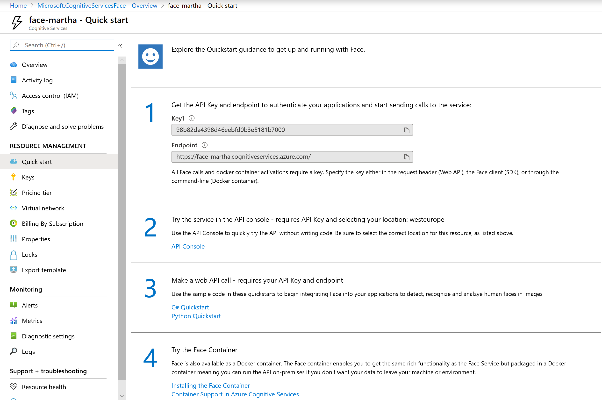

```python
import requests
import json

# set to your own subscription key value
subscription_key = "xxx" # Paste your API key here
assert subscription_key

# replace <My Endpoint String> with the string from your endpoint URL
face_api_url = 'https://<My Endpoint String>.com/face/v1.0/detect'

image_url = 'https://upload.wikimedia.org/wikipedia/commons/3/37/Dagestani_man_and_woman.jpg'

headers = {'Ocp-Apim-Subscription-Key': subscription_key}

params = {
    'returnFaceId': 'true',
    'returnFaceLandmarks': 'false',
    'returnFaceAttributes': 'age,gender,headPose,smile,facialHair,glasses,emotion,hair,makeup,occlusion,accessories,blur,exposure,noise',
}

response = requests.post(face_api_url, params=params,
                         headers=headers, json={"url": image_url})
print(json.dumps(response.json(), indent = 2))
```

### Examine the response

A successful response is returned in JSON.

```json
[
  {
    "faceId": "e93e0db1-036e-4819-b5b6-4f39e0f73509",
    "faceRectangle": {
      "top": 621,
      "left": 616,
      "width": 195,
      "height": 195
    },
    "faceAttributes": {
      "smile": 0,
      "headPose": {
        "pitch": 0,
        "roll": 6.8,
        "yaw": 3.7
      },
      "gender": "male",
      "age": 37,
      "facialHair": {
        "moustache": 0.4,
        "beard": 0.4,
        "sideburns": 0.1
      },
      "glasses": "NoGlasses",
      "emotion": {
        "anger": 0,
        "contempt": 0,
        "disgust": 0,
        "fear": 0,
        "happiness": 0,
        "neutral": 0.999,
        "sadness": 0.001,
        "surprise": 0
      },
      "blur": {
        "blurLevel": "high",
        "value": 0.89
      },
      "exposure": {
        "exposureLevel": "goodExposure",
        "value": 0.51
      },
      "noise": {
        "noiseLevel": "medium",
        "value": 0.59
      },
      "makeup": {
        "eyeMakeup": true,
        "lipMakeup": false
      },
      "accessories": [],
      "occlusion": {
        "foreheadOccluded": false,
        "eyeOccluded": false,
        "mouthOccluded": false
      },
      "hair": {
        "bald": 0.04,
        "invisible": false,
        "hairColor": [
          {
            "color": "black",
            "confidence": 0.98
          },
          {
            "color": "brown",
            "confidence": 0.87
          },
          {
            "color": "gray",
            "confidence": 0.85
          },
          {
            "color": "other",
            "confidence": 0.25
          },
          {
            "color": "blond",
            "confidence": 0.07
          },
          {
            "color": "red",
            "confidence": 0.02
          }
        ]
      }
    }
  },
  {
    "faceId": "37c7c4bc-fda3-4d8d-94e8-b85b8deaf878",
    "faceRectangle": {
      "top": 693,
      "left": 1503,
      "width": 180,
      "height": 180
    },
    "faceAttributes": {
      "smile": 0.003,
      "headPose": {
        "pitch": 0,
        "roll": 2,
        "yaw": -2.2
      },
      "gender": "female",
      "age": 56,
      "facialHair": {
        "moustache": 0,
        "beard": 0,
        "sideburns": 0
      },
      "glasses": "NoGlasses",
      "emotion": {
        "anger": 0,
        "contempt": 0.001,
        "disgust": 0,
        "fear": 0,
        "happiness": 0.003,
        "neutral": 0.984,
        "sadness": 0.011,
        "surprise": 0
      },
      "blur": {
        "blurLevel": "high",
        "value": 0.83
      },
      "exposure": {
        "exposureLevel": "goodExposure",
        "value": 0.41
      },
      "noise": {
        "noiseLevel": "high",
        "value": 0.76
      },
      "makeup": {
        "eyeMakeup": false,
        "lipMakeup": false
      },
      "accessories": [],
      "occlusion": {
        "foreheadOccluded": false,
        "eyeOccluded": false,
        "mouthOccluded": false
      },
      "hair": {
        "bald": 0.06,
        "invisible": false,
        "hairColor": [
          {
            "color": "black",
            "confidence": 0.99
          },
          {
            "color": "gray",
            "confidence": 0.89
          },
          {
            "color": "other",
            "confidence": 0.64
          },
          {
            "color": "brown",
            "confidence": 0.34
          },
          {
            "color": "blond",
            "confidence": 0.07
          },
          {
            "color": "red",
            "confidence": 0.03
          }
        ]
      }
    }
  }
]
```

## Azure Cognitive Services - Computer Vision Service

|Azure Cognitive Services|Information|
|---|---|
|[Computer Vision API](https://azure.microsoft.com/en-us/services/cognitive-services/computer-vision)|https://docs.microsoft.com/en-us/azure/cognitive-services/computer-vision/home
|[Custom Vision Service](https://azure.microsoft.com/en-us/services/cognitive-services/custom-vision-service/)|https://docs.microsoft.com/en-us/azure/cognitive-services/custom-vision-service/home


In the language of your choice (Python solution is provided), write two small scripts that

1. Convert hand-written text from an image into text - Test data: [1](https://bootcamps.blob.core.windows.net/ml-test-images/ocr_handwritten_1.jpg), [2](https://bootcamps.blob.core.windows.net/ml-test-images/ocr_handwritten_2.jpg)
1. Convert printed text from an image into text - Test data: [1](https://bootcamps.blob.core.windows.net/ml-test-images/ocr_printed_1.jpg), [2](https://bootcamps.blob.core.windows.net/ml-test-images/ocr_printed_2.jpg)

### Optical Character Recognition - Images to Text - Handwritten content

:triangular_flag_on_post: **Goal:** Leverage OCR to make a hand-written text document in images machine-readable

First, create a `Computer Vision` API Key in the Azure Portal

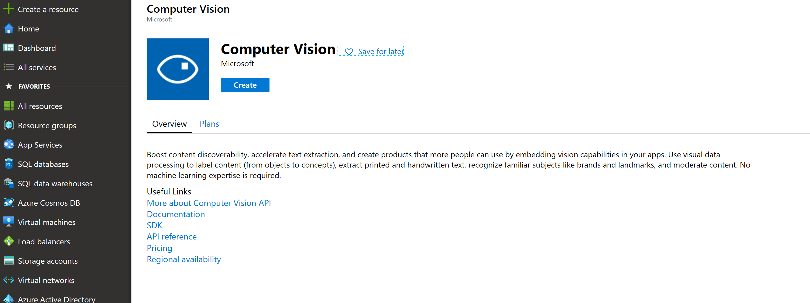


As we're dealing with images, we need a few Python packages to help with this:

```python
import requests, json, time
import matplotlib.pyplot as plt
from matplotlib.patches import Rectangle
from matplotlib.patches import Polygon
from PIL import Image
from io import BytesIO
```

Ok, now we can start recognizing some text. With the Computer Vision API, this is a two-step process:

1. Submit the image
1. Query if the image has been processed

```python
key = "xxxx" # Paste your API Key here!

url = "https://westeurope.api.cognitive.microsoft.com/vision/v2.0/recognizeText"
image_url = "https://upload.wikimedia.org/wikipedia/commons/thumb/d/dd/Cursive_Writing_on_Notebook_paper.jpg/800px-Cursive_Writing_on_Notebook_paper.jpg"

headers = {'Ocp-Apim-Subscription-Key': key}
params  = {'mode': 'Handwritten'}
data    = {'url': image_url}

# Post image URL to the API
response = requests.post(url, headers=headers, params=params, json=data)

# Return query URL for getting the status
operation_url = response.headers["Operation-Location"]

# Poll until we get a result (...or something failed)
recogntion = {}
poll = True
while (poll):
    response_final = requests.get(operation_url, headers=headers)
    recogntion = response_final.json()
    time.sleep(1)
    if ("recognitionResult" in recogntion):
        poll= False 
    if ("status" in recogntion and recogntion['status'] == 'Failed'):
        poll= False

print(json.dumps(recogntion, indent=2))
```
Example Notebook and Result: 


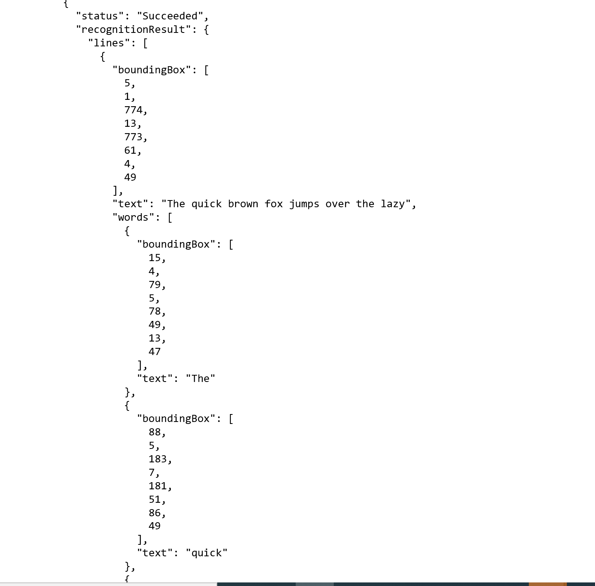

Ok, looks like it recognized something. Let's visualize it:

```python
polygons = []

# Get bounding boxes of the text 
if ("recognitionResult" in recogntion):
    polygons = [(line["boundingBox"], line["text"])
        for line in recogntion["recognitionResult"]["lines"]]

# Display image and overlay text
plt.figure(figsize=(15, 15))
image = Image.open(BytesIO(requests.get(image_url).content))
ax = plt.imshow(image)
for polygon in polygons:
    vertices = [(polygon[0][i], polygon[0][i+1])
        for i in range(0, len(polygon[0]), 2)]
    text = polygon[1]
    patch = Polygon(vertices, closed=True, fill=False, linewidth=2, color='y')
    ax.axes.add_patch(patch)
    plt.text(vertices[0][0], vertices[0][1], text, fontsize=20, va="top")
_ = plt.axis("off")
```

Example Result: 

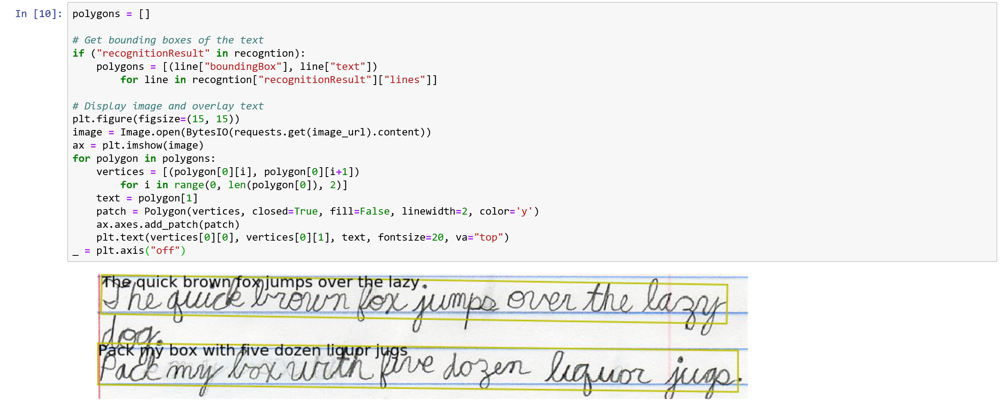

Here are two more images we can test with:

```
https://bootcamps.blob.core.windows.net/ml-test-images/ocr_handwritten_1.jpg
https://bootcamps.blob.core.windows.net/ml-test-images/ocr_handwritten_2.jpg
```

### Optical Character Recognition - Images to Text - Printed content

:triangular_flag_on_post: **Goal:** Leverage OCR to make a printed text document in images machine-readable

Extracting text from printed text in images is very similar - except that is a synchronous call, hence we directly get back the recognition result:

```python
    key = "xxxx" # Paste your API Key here!
    
    url = "https://westeurope.api.cognitive.microsoft.com/vision/v2.0/ocr"
    image_url = "https://bootcamps.blob.core.windows.net/ml-test-images/ocr_printed_1.jpg"
    
    headers = {'Ocp-Apim-Subscription-Key': key}
    params  = {'language': 'unk', 'detectOrientation': 'true'}
    data    = {'url': image_url}
    
    response = requests.post(url, headers=headers, params=params, json=data)
    recognition_result = response.json()
    
    # Extract the word bounding boxes and text
    line_infos = [region["lines"] for region in recognition_result["regions"]]
    word_infos = []
    for line in line_infos:
        for word_metadata in line:
            for word_info in word_metadata["words"]:
                word_infos.append(word_info)
    word_infos
```

Example Notebook:

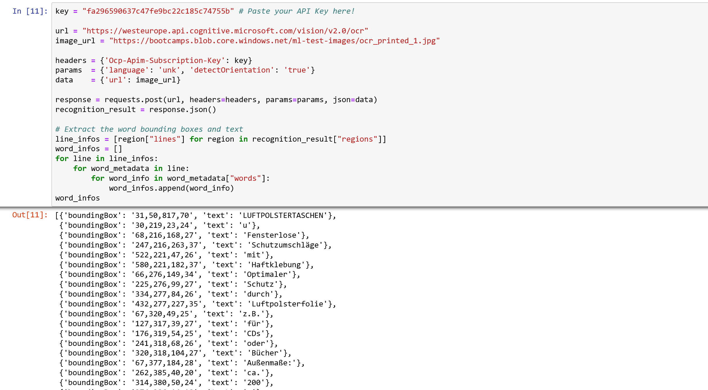

```python
# Display the image and overlay it with the extracted text
plt.figure(figsize=(15, 15))
image = Image.open(BytesIO(requests.get(image_url).content))
ax = plt.imshow(image, alpha=0.5)
for word in word_infos:
    bbox = [int(num) for num in word["boundingBox"].split(",")]
    text = word["text"]
    origin = (bbox[0], bbox[1])
    patch  = Rectangle(origin, bbox[2], bbox[3], fill=False, linewidth=2, color='y')
    ax.axes.add_patch(patch)
    plt.text(origin[0], origin[1], text, fontsize=12, weight="bold", va="top")
plt.axis("off")
```

Example Result:

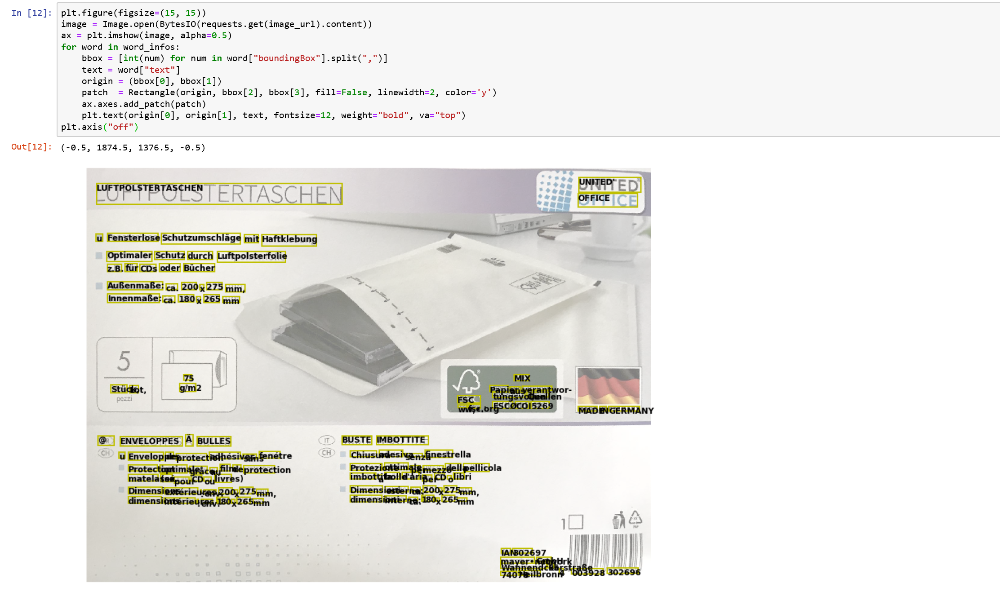

Here are two more images we can test with:

```
https://bootcamps.blob.core.windows.net/ml-test-images/ocr_printed_1.jpg
https://bootcamps.blob.core.windows.net/ml-test-images/ocr_printed_2.jpg
```

## Azure Cognitive Services - Custom Vision Service for Detecting Objects in Images

:triangular_flag_on_post: **Goal:** Detect beer glasses in images

1. Use [Custom Vision](https://customvision.ai) to detect beer glasses in images - [Image Dataset for training and testing](https://bootcamps.blob.core.windows.net/ml-test-images/beer_glasses.zip)

First, log in to [Custom Vision](https://www.customvision.ai/) with your Azure credentials.

Create a new project of type `Object detection`:

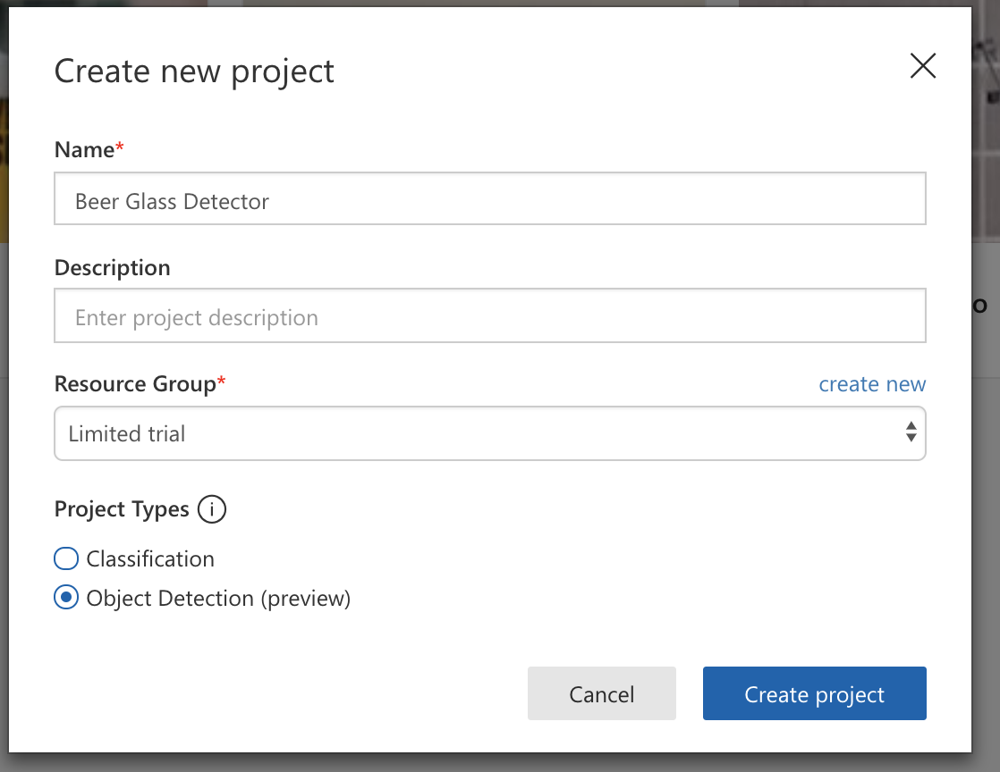

Next, add all the training images from the [dataset](./data/beer_glassess). Once added, we need to tag all the beer glasses in the images. If there are multiple glasses in one image, tag each one individually:

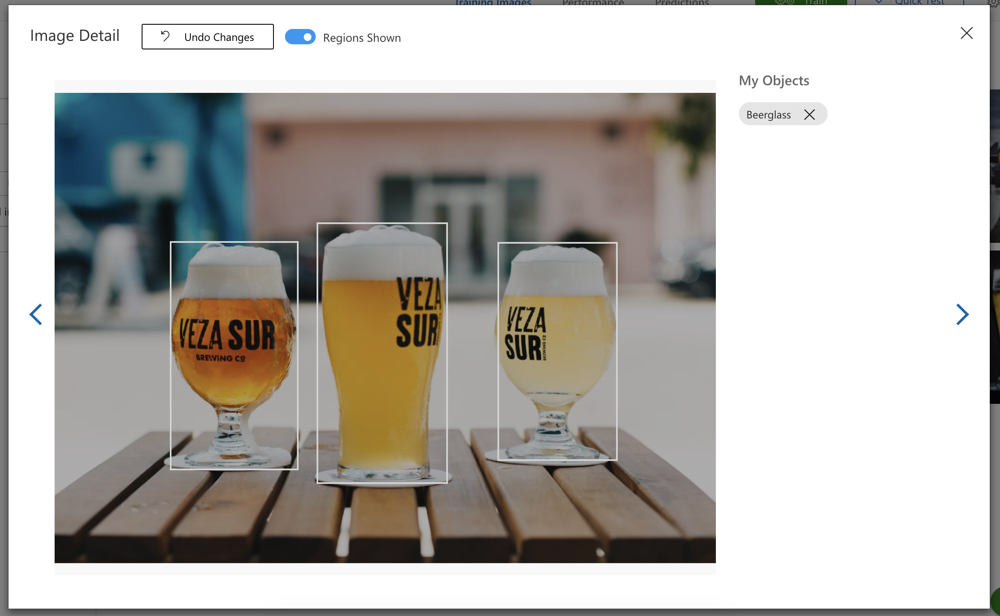

Once we've tagged all 15 images (that's the minimum), we can hit the `Train` button. After 1-2 minutes, we'll see the training statistics:

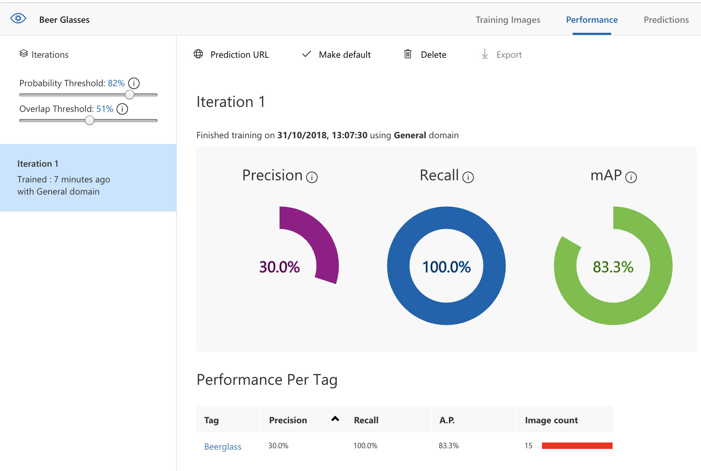

Let's briefly look at the results and make sure we understand them:

Sliders - they set the results given certain thresholds
* Probability Threshold: 82% - this means we only count detections with over 82% probability as beer glasses
* Overlap Threshold: 51% - this means we want our detection results overlap at least 51% with the ground truth in the training set

Results:
* Precision: 30% - given a detection, it is 30% correct on average (meaning the algorithm will also detect other objects as glasses)
* Recall: 100% - a recall of 100% means, it will detect all beer glasses (but maybe mistake some other objects as beer glasses too)
* mAP: 83.3% - mean average precision - the average how well our detection algorithm works 

Under `Quick Test`, we can briefly upload our testing images and see what the service will detect. As we only added 15 training images with a lot of variance, the results are not great yet. By adding more images, we could most likely improve the detection performance significantly.

If we go to the `Performance` tab, we can get the `Prediction URL` and the `Prediction-Key`. We can use this endpoint to programmatically access the service.

## Azure Cognitive Services - Speech

:triangular_flag_on_post: **Goal:** Leverage Speech-to-Text and Text-to-Speech

In the language of your choice (Python solution is provided), write two small scripts or apps that

1. Convert written text into speech (German or English)
1. Convert speech into written text (German or English)

You can use can use this file: [`data/test.wav`](data/test.wav) (English).

Now that we have converted a user's speech input into text, we'll try to determine the intent of that text in the next challenge.


As region, we'll be using `West Europe` in this example. You can find your API key under the service, then `Keys`.

You can use this file [`test.wav`](../data/test.wav) for testing.

### Text-to-Speech

First, we need to request a token from the `Issue Token endpoint` of the Speech API. Each token is valid for 10 minutes, hence we can either reuse it multiple times (to minimize network traffic and latency), or request a new one for each call:

```python
import requests, json
import IPython.display as ipd

api_key = "xxxx" # Enter your API key here

token_url = "https://westeurope.api.cognitive.microsoft.com/sts/v1.0/issuetoken"
headers = {'Ocp-Apim-Subscription-Key': api_key}

response = requests.post(token_url, headers=headers)
token = response.text

print("Token: " + token)
```

Once we have the token, we can form our request for generating speech:

```python
url = "https://westeurope.tts.speech.microsoft.com/cognitiveservices/v1"
headers = {'Authorization': token,
           'Content-Type': 'application/ssml+xml',
           'User-Agent': 'Test',
           'X-Microsoft-OutputFormat': 'riff-16khz-16bit-mono-pcm'}

data = "<speak version='1.0' xmlns='http://www.w3.org/2001/10/synthesis' xml:lang='en-US'> \
<voice name='Microsoft Server Speech Text to Speech Voice (en-US, JessaRUS)'> \
    Hello, welcome to the AI Developer College!  \
</voice></speak>"

response = requests.post(url, headers=headers, data=data)
audio_data = response.content

print(response.headers)
```

We can just write it out to a `*.wav` file and then download or play it:

```python
with open("test.wav", "wb") as f: 
    f.write(audio_data)
    
ipd.Audio('test.wav')
```

There are [many different voices](https://docs.microsoft.com/en-us/azure/cognitive-services/speech-service/language-support#text-to-speech) available to choose from. By updating the [XML request](https://docs.microsoft.com/en-us/azure/cognitive-services/speech-service/how-to-text-to-speech#specify-a-voice), we can easily specify a different voice or language. From here on, it should be easy to generate German speech.

### Speech-to-Text

Let's take the generated or provided `test.wav` from the example before and convert it back to text. Again, let's first create a token:

```python
import requests, json

api_key = "xxx" # Enter your API key here

token_url = "https://westeurope.api.cognitive.microsoft.com/sts/v1.0/issuetoken"
headers = {'Ocp-Apim-Subscription-Key': api_key}

response = requests.post(token_url, headers=headers)
token = response.text

print("Token: " + token)
```

Now that we have a token, we can call the speech-to-text endpoint and include the `wav` data:

```python
url = "https://westeurope.stt.speech.microsoft.com/speech/recognition/conversation/cognitiveservices/v1"

headers = {'Authorization': 'Bearer ' + token,
           'Accept': 'application/json',
           'Ocp-Apim-Subscription-Key': api_key,
           'Content-Type': 'audio/wav; codec=audio/pcm; samplerate=16000'}

params = {'language': 'en-US', 'format': 'detailed'}

with open("test.wav", 'rb') as f:
    data = f.read()

response = requests.post(url, headers=headers, params=params, data=data)
print(json.dumps(response.json(), indent=2))
```

For recognizing longer text with multiple sentences, you can follow the [following tutorial](https://docs.microsoft.com/en-us/azure/cognitive-services/speech-service/quickstart-python).

***Note:***

Compressed audio is supported (e.g., MP3s), see [here](https://docs.microsoft.com/en-us/azure/cognitive-services/speech-service/how-to-use-codec-compressed-audio-input-streams),

Besides that, the speech-to-text API expects audio with the following specifics:
* 16-bit WAV format with PCM or OGG format with OPUS
* Single channel (mono) at 8 or 16 KHz

More details, see [here](https://docs.microsoft.com/en-us/azure/cognitive-services/speech-service/how-to-use-audio-input-streams).

Now that we've converted the user's speech into text, we can detect the intent of the text in the next challenge!

## Azure Cognitive Services - Language - Reveal the intention of the text

For retrieving the intent of the text, we'll be using the Language Understanding service in Azure, called LUIS. In many cases, LUIS is used to power chatbots, but it can also be used for "standalone" processing of text. We could even use it for e.g., automatically analyzing emails and categorizing them, or figuring out what products and amounts are on an invoice.

:triangular_flag_on_post: **Goal:** Make your application understand the meaning of text

In the language of your choice (Python solution is provided), write two small scripts or apps that

1. Translate the input text into German (using the Text Translator API)
1. Detect the intent and entities of the text (German) - see examples below (using [https://eu.luis.ai](https://eu.luis.ai))

Let's use an example where we want to detect a Pizza order from the user. We also want to detect if the user wants to cancel an order.

Head to [`eu.luis.ai`](https://eu.luis.ai) and create a new LUIS app. As a base language, fell free to either choose German or English (English supports a few more features as of May 2019).

Quick explanation on how LUIS works:

* Under Intents, we'll define the "actions" we can to detect
* Under Entities, we'll define the "things" we want to extract from the intents
* Utterances are just examples that we'll use to train LUIS

Create two new intents:

* `CreateOrder`
* `CancelOrder`

Then, add the utterances (our training examples) from the main page of this repository to the three intents.


LUIS example data:

```
2 Intents: "CreateOrder", "CancelOrder"

Utterances:

(CreateOrder) Ich moechte eine Pizza Salami bestellen 
(CreateOrder) Vier Pizza Hawaii bitte 

(CancelOrder) Bitte Bestellung 123 stornieren
(CancelOrder) Cancel bitte Bestellung 42
(CancelOrder) Ich will Order 933 nicht mehr

(None) Wieviel Uhr ist heute?
(None) Wie ist das Wetter in Berlin?
(None) Bitte Termin fuer Montag einstellen
```


Hit `Train`.

Once we hit `Test`, we can test if the systems is able to recognize the intent of our text. We'll notice that it is not working that well, hence we can add some more examples and re-train.

Next, we can try to detect `Entities` in our text inputs. For that, goto Entities and add a `Prebuilt Entity` with the type `Number`. This will automatically detect all numbers (e.g. the order number or amount of pizzas) in our text. Secondly, add a normal Entity `Pizza Type` with entity type `Machine learned` (ideally we could also use an entity and specify all possible Pizzas we sell). Lastly, add an entity of type `Machine learned` with the name `PizzaOrder` and add `Number` and `Pizza Type` as children. 


Further we will add a `PizzaPhraseList` with some `Pizza Type Samples`:

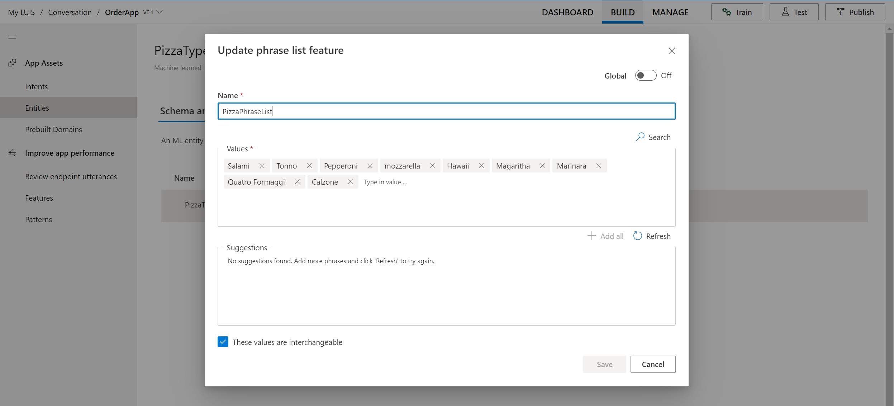

As we can see, LUIS supports a range of entity types, like regex, lists, etc.

Finally, we can annotate our training examples. Numbers will automatically be detected (as it is a prebuilt type), but we need to tell LUIS, what `PizzaOrder` is. This is a bit tricky, first click the beginning of the entity (= the detected number) and then directly click the last part of the entity (= the pizza type) and then select `PizzaOrder`. Then tag all pizza types inside the `PizzaOrder` as `Pizza Type`. The final tagging should look something like this (make sure the green line covers the whole phrase):


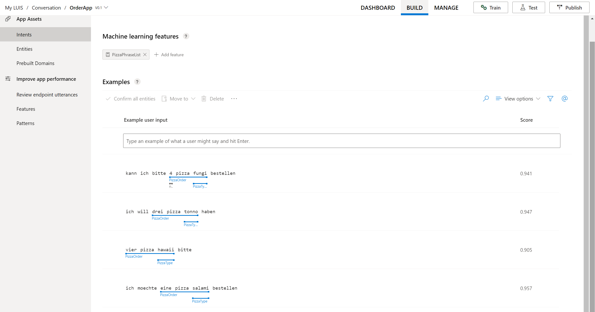


Hit `Train` again to give it a final training. Lastly, hit `Publish` and publish it to `Production`. Review the endpoints and copy the endpoint URL (can be found under `Manage` --> `Azure Resources`). It should look something like this:

```
https://westeurope.api.cognitive.microsoft.com/luis/v2.0/apps/xxxxxx-xxxx-xxxx-xxxx-xxxxxxxx?subscription-key=xxxxxxx&timezoneOffset=-360&q=
```

With a bit of Python, we can now get the intent through the API:

```python
import requests, json

# Paste your Endpoint URL here
url = "https://westeurope.api.cognitive.microsoft.com/luis/v2.0/apps/xxxxxx-xxxx-xxxx-xxxx-xxxxxxxx?subscription-key=xxxxxxx&timezoneOffset=-360&q="

query = "ich hätte gerne 9 pizza calzone"

response = requests.get(url + query)
print(json.dumps(response.json(), indent=2))
```

The output should look something like this:

```json

{
  "query": "ich h\u00e4tte gerne 9 pizza calzone",
  "topScoringIntent": {
    "intent": "CreateOrder",
    "score": 0.4941804
  },
  "entities": [
    {
      "entity": "calzone",
      "type": "PizzaType",
      "startIndex": 24,
      "endIndex": 30,
      "score": 0.80077827
    },
    {
      "entity": "9 pizza calzone",
      "type": "PizzaOrder",
      "startIndex": 16,
      "endIndex": 30,
      "score": 0.566134334
    },
    {
      "entity": "9",
      "type": "builtin.number",
      "startIndex": 16,
      "endIndex": 16,
      "resolution": {
        "subtype": "integer",
        "value": "9"
      }
    }
  ]
}
​
​
```

Excellent - Now we know what the user wants to order, and the associated quantities. :pizza: :pizza: :pizza:

## Azure Cognitive Services - Search

:triangular_flag_on_post: **Goal:** Write a script for auto-suggestion of text

1. Leverage Bing Autosuggest to make predictions on how a user might wants to continue an half-written sentence

First, create a `Bing Search v7` API Key in the Azure Portal:

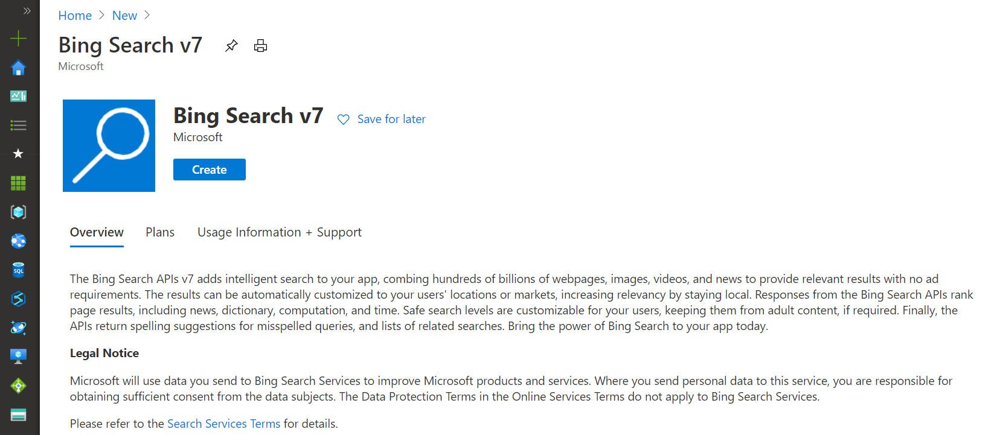

As in challenge 3 and 5, we can either create a token for our requests, or directly access the service by specifying the API key we've just created:


```python
import requests, json

key = "xxx" # Paste your API key here
url = "https://api.bing.microsoft.com/v7.0/Suggestions"

search_term = "warum ist"

headers = {"Ocp-Apim-Subscription-Key" : key}
params  = {"q": search_term}

response = requests.get(url, headers=headers, params=params)
print(json.dumps(response.json(), indent=2))
```

Let's print it a bit nicer:

```python
suggestions = response.json()['suggestionGroups'][0]['searchSuggestions']

for s in suggestions:
    print(s['displayText'])
```

Output:

```json
warum ist
warum ist das
warum ist es so
warum ist blut rot
warum ist messi klein
warum ist stuhl braun
warum ist diamant hart
warum ist rauchen cool
```

People search for weird stuff... :flushed: :satisfied:


## House Keeping: Lab Cleanup

### Use Azure CLI to Delete Resource Group

1. In the **Cloud Shell** command prompt at the bottom of the portal, type in the following command and press **Enter** to list all resource groups in the subscription:

    ```sh
    az group list
    ```

2. Type in the following command and press **Enter** to delete the **yourResourceGroup** *Resource Group*:

    ```sh
    az group delete --name "yourResourceGroup" --no-wait --yes
    ```

3. Close the **Cloud Shell** prompt at the bottom of the portal.

4. Close your browser application.

## Optional: Play around with the: Intelligent Kiosk 

Find the Sample on Github here: [Intelligent Kiosk](https://github.com/microsoft/Cognitive-Samples-IntelligentKiosk)
